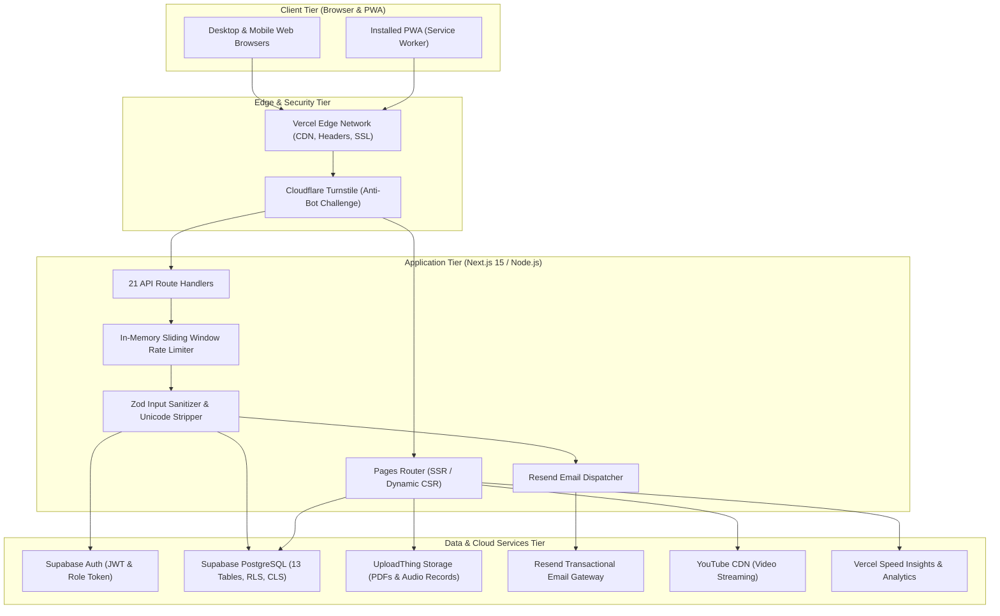
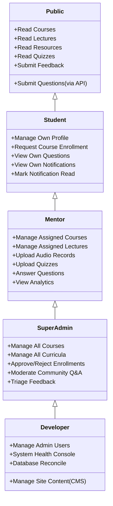

# PharmaCore — System Architecture & Design

## 1. High-Level Architecture Overview

PharmaCore follows a modern, decoupled cloud architecture built on **Next.js 15 (Pages Router)**, **React 19**, and **Supabase (PostgreSQL 15)**. The frontend delivers server-rendered initial HTML shells with client-side hydration, while the backend utilizes Next.js Serverless API Route Handlers integrated with PostgreSQL via Row Level Security (RLS) policies.



---

## 2. Core Architectural Subsystems

### 2.1 Frontend Subsystem (Next.js 15 Pages Router)
- **Routing Paradigm**: File-system based routing in `pages/` with dynamic parameter support (`[id].tsx`).
- **State Management**:
  - `AuthProvider` (`components/AuthProvider.tsx`): Manages user session, JWT tokens, profile metadata, and real-time auth state changes (`onAuthStateChange`).
  - `ThemeProvider` (`components/ThemeProvider.tsx`): Manages dark/light theme classes on `<html>` with persistent local storage sync.
  - `SiteContentProvider` (`components/SiteContentProvider.tsx`): Injects dynamic website copy from `site_content` table with fallback to static constants in `lib/siteContent.ts`.
- **Localization**: Native bilingual routing via `next-i18next` (`ar` default with RTL text direction; `en` with LTR text direction).
- **Code Splitting**: Dynamic lazy-loading of heavy admin modules (`CurriculumManager`, `AnalyticsDashboard`, `CommunityManager`, `SiteContentManager`) via `next/dynamic` to ensure rapid public page rendering.

### 2.2 API & Serverless Subsystem (`pages/api/`)
- **21 Isolated Endpoints**: Clean single-responsibility handlers grouped by functional domains (`students/`, `admin/`, `courses/`, `feedback/`, `questions/`, `uploadthing.ts`).
- **Standardized Execution Pipeline**:
  ```mermaid
  sequenceDiagram
      autonumber
      actor Client as Web Browser
      participant Edge as Security Middleware / Headers
      participant RL as Rate Limiter (lib/rateLimit.ts)
      participant Turnstile as Turnstile Verifier (lib/turnstile.ts)
      participant Zod as Zod Schema Validator
      participant Auth as Supabase Auth & Role Check
      participant DB as PostgreSQL (RLS / Admin Client)

      Client->>Edge: HTTP Request (Method, Headers, IP, Body)
      Edge->>RL: Check IP / User Quota
      alt Rate Limit Exceeded
          RL-->>Client: 429 Too Many Requests (Retry-After)
      end
      RL->>Turnstile: Verify Token (if protected route)
      alt Token Invalid / Bot Detected
          Turnstile-->>Client: 400 Bad Request / 403 Forbidden
      end
      Turnstile->>Zod: Sanitize & Validate Payload
      alt Schema Validation Failed
          Zod-->>Client: 400 Bad Request (Formatted Errors)
      end
      Zod->>Auth: Extract Bearer Token & Resolve Role
      alt Unauthorized / Privilege Insufficient
          Auth-->>Client: 401 Unauthorized / 403 Forbidden
      end
      Auth->>DB: Execute Query (Supabase Admin / Client)
      DB-->>Client: 200 OK / 201 Created (Standard JSON Envelope)
  ```

---

## 3. Database Architecture & Security Model

### 3.1 Non-Recursive Role Resolution Function
To prevent PostgreSQL infinite recursion error `42P17` when evaluating Row Level Security policies, the system utilizes a `SECURITY DEFINER` function:

```sql
CREATE OR REPLACE FUNCTION public.get_user_role()
RETURNS TEXT AS $$
  SELECT role FROM public.users WHERE id = auth.uid();
$$ LANGUAGE sql SECURITY DEFINER STABLE SET search_path = public;
```

### 3.2 Role-Based Access Control (RBAC) Architecture


### 3.3 Column Level Security (CLS) on Community Q&A
Student email privacy is protected at the database engine level. Direct client-side `SELECT` operations on `community_questions` cannot access the `author_email` column:
```sql
REVOKE SELECT ON public.community_questions FROM anon, authenticated;
GRANT SELECT (id, lecture_id, user_id, author_name, text, created_at, is_anonymous) 
  ON public.community_questions TO anon, authenticated;
```

---

## 4. Third-Party Integrations & Trust Boundaries

| Integration | Protocol | Responsibility | Trust Boundary |
|---|---|---|---|
| **Supabase** | HTTPS / WSS / PostgREST | PostgreSQL, Auth, Realtime event bus | Internal Data Tier (Protected by Service Role & RLS) |
| **UploadThing** | HTTPS / SDK | Presigned asset storage (Audio & PDF) | Semi-Trusted (Staff RBAC verified before presign) |
| **Cloudflare Turnstile** | HTTPS REST | Anti-automation challenge verification | External Security Gate (Secret Key strictly isolated) |
| **Resend** | HTTPS REST | Transactional email delivery | External Messaging (Strictly isolated in serverless handler) |
| **YouTube** | IFrame API | Embed video lecture streaming | Client-Side Embedded (Sandboxed player) |
| **Vercel** | Edge Network | CDN, SSL, DNS, Serverless execution | Hosting Infrastructure |

---

## 5. Failure Boundaries & Resilience

1. **Database Degradation**: When Supabase API experiences high latency, read-only content falls back to cached statically rendered shells.
2. **Turnstile Failure**: If Cloudflare Turnstile times out or environment variable keys are omitted during local development, `lib/turnstile.ts` fails safely in development mode while strictly blocking unverified production requests.
3. **Email Outage**: Resend API dispatches are wrapped in `try/catch` non-blocking blocks so that answering a question or submitting an announcement still succeeds in the database even if email delivery fails.
4. **Rate Limiting Degradation**: If in-memory rate limiter capacity is exhausted, it aggressively purges expired sliding-window buckets to reclaim heap space without crashing the Node.js process.
