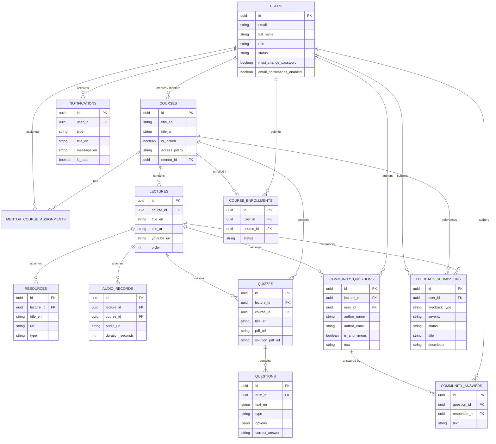

# Database Entity Relationships & Integrity Rules

## 1. Entity-Relationship Diagram (Mermaid)

---

## 2. Foreign Key Cascade & Orphan Prevention Rules

1. **Course Deletion (`ON DELETE CASCADE`)**:
   - Deleting a course automatically cascades and purges all child `lectures`, `mentor_course_assignments`, `quizzes`, and `course_enrollments`.
2. **Lecture Deletion (`ON DELETE CASCADE`)**:
   - Deleting a lecture automatically cascades and purges all child `resources`, `audio_records`, `quizzes`, and `community_questions`.
3. **Question Deletion (`ON DELETE CASCADE`)**:
   - Deleting a community question purges all associated `community_answers`.
4. **User Deletion / Account Removal**:
   - Deleting a user account sets `mentor_id` to `NULL` on courses, sets `responder_id` to `NULL` on community answers, and sets `resolved_by` to `NULL` on feedback, preserving curriculum and historical discussion records.
