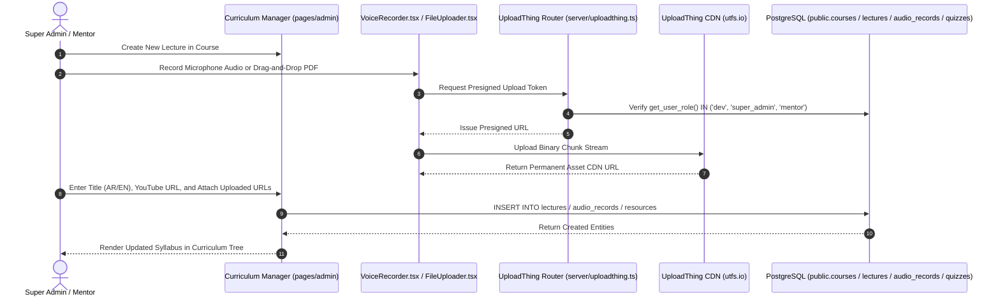

# Data Flow: Administrative Curriculum Authoring & Asset Upload

```mermaid
sequenceDiagram
    autonumber
    actor Staff as Super Admin / Mentor
    participant Console as Curriculum Manager (pages/admin)
    participant Voice as VoiceRecorder.tsx / FileUploader.tsx
    participant UTRouter as UploadThing Router (server/uploadthing.ts)
    participant UTStorage as UploadThing CDN (utfs.io)
    participant DB as PostgreSQL (public.courses / lectures / audio_records / quizzes)

    Staff->>Console: Create New Lecture in Course
    Staff->>Voice: Record Microphone Audio or Drag-and-Drop PDF
    Voice->>UTRouter: Request Presigned Upload Token
    UTRouter->>DB: Verify get_user_role() IN ('dev', 'super_admin', 'mentor')
    UTRouter-->>Voice: Issue Presigned URL
    Voice->>UTStorage: Upload Binary Chunk Stream
    UTStorage-->>Voice: Return Permanent Asset CDN URL
    Staff->>Console: Enter Title (AR/EN), YouTube URL, and Attach Uploaded URLs
    Console->>DB: INSERT INTO lectures / audio_records / resources
    DB-->>Console: Return Created Entities
    Console-->>Staff: Render Updated Syllabus in Curriculum Tree
```
