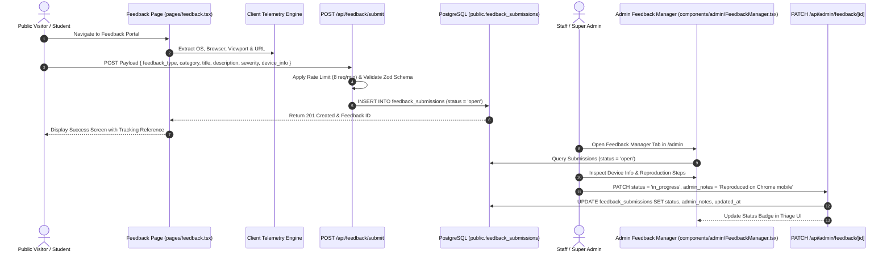

# Data Flow: Feedback Submission & Bug Triage

```mermaid
sequenceDiagram
    autonumber
    actor User as Public Visitor / Student
    participant Portal as Feedback Page (pages/feedback.tsx)
    participant Telemetry as Client Telemetry Engine
    participant SubmitAPI as POST /api/feedback/submit
    participant DB as PostgreSQL (public.feedback_submissions)
    actor Admin as Staff / Super Admin
    participant TriagePortal as Admin Feedback Manager (components/admin/FeedbackManager.tsx)
    participant PatchAPI as PATCH /api/admin/feedback/[id]

    User->>Portal: Navigate to Feedback Portal
    Portal->>Telemetry: Extract OS, Browser, Viewport & URL
    User->>SubmitAPI: POST Payload { feedback_type, category, title, description, severity, device_info }
    SubmitAPI->>SubmitAPI: Apply Rate Limit (8 req/min) & Validate Zod Schema
    SubmitAPI->>DB: INSERT INTO feedback_submissions (status = 'open')
    DB-->>Portal: Return 201 Created & Feedback ID
    Portal-->>User: Display Success Screen with Tracking Reference

    Admin->>TriagePortal: Open Feedback Manager Tab in /admin
    TriagePortal->>DB: Query Submissions (status = 'open')
    Admin->>TriagePortal: Inspect Device Info & Reproduction Steps
    Admin->>PatchAPI: PATCH status = 'in_progress', admin_notes = 'Reproduced on Chrome mobile'
    PatchAPI->>DB: UPDATE feedback_submissions SET status, admin_notes, updated_at
    PatchAPI-->>TriagePortal: Update Status Badge in Triage UI
```
