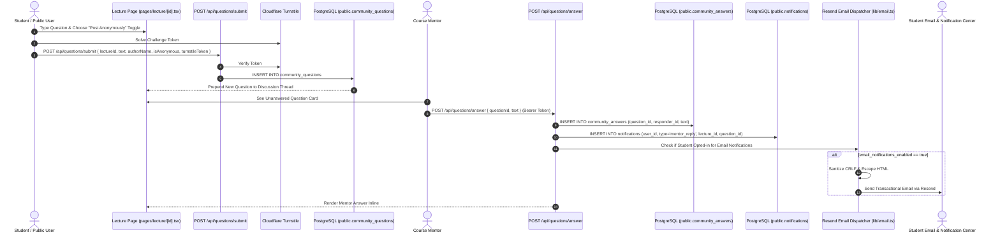

# Data Flow: Community Q&A, Mentor Answer & Notification

```mermaid
sequenceDiagram
    autonumber
    actor Student as Student / Public User
    participant LectureView as Lecture Page (pages/lecture/[id].tsx)
    participant QSubmitAPI as POST /api/questions/submit
    participant Turnstile as Cloudflare Turnstile
    participant QDB as PostgreSQL (public.community_questions)
    actor Mentor as Course Mentor
    participant QAnswerAPI as POST /api/questions/answer
    participant ADB as PostgreSQL (public.community_answers)
    participant NotifDB as PostgreSQL (public.notifications)
    participant EmailEngine as Resend Email Dispatcher (lib/email.ts)
    actor StudentInbox as Student Email & Notification Center

    Student->>LectureView: Type Question & Choose "Post Anonymously" Toggle
    Student->>Turnstile: Solve Challenge Token
    Student->>QSubmitAPI: POST /api/questions/submit { lectureId, text, authorName, isAnonymous, turnstileToken }
    QSubmitAPI->>Turnstile: Verify Token
    QSubmitAPI->>QDB: INSERT INTO community_questions
    QDB-->>LectureView: Prepend New Question to Discussion Thread

    Mentor->>LectureView: See Unanswered Question Card
    Mentor->>QAnswerAPI: POST /api/questions/answer { questionId, text } (Bearer Token)
    QAnswerAPI->>ADB: INSERT INTO community_answers (question_id, responder_id, text)
    QAnswerAPI->>NotifDB: INSERT INTO notifications (user_id, type='mentor_reply', lecture_id, question_id)
    
    QAnswerAPI->>EmailEngine: Check if Student Opted-in for Email Notifications
    alt email_notifications_enabled == true
        EmailEngine->>EmailEngine: Sanitize CRLF & Escape HTML
        EmailEngine->>StudentInbox: Send Transactional Email via Resend
    end
    QAnswerAPI-->>LectureView: Render Mentor Answer Inline
```
