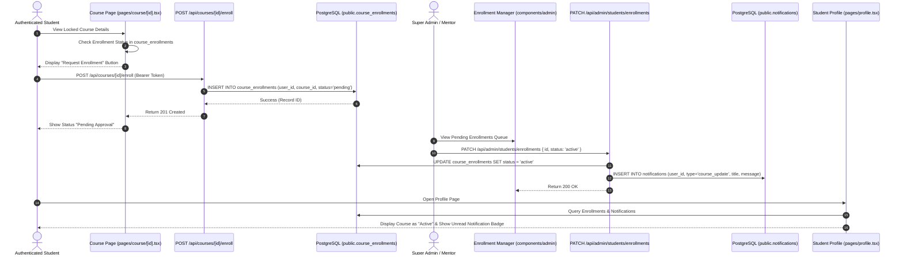

# Data Flow: Student Course Enrollment & Approval

```mermaid
sequenceDiagram
    autonumber
    actor Student as Authenticated Student
    participant CourseView as Course Page (pages/course/[id].tsx)
    participant EnrollAPI as POST /api/courses/[id]/enroll
    participant DB as PostgreSQL (public.course_enrollments)
    actor Admin as Super Admin / Mentor
    participant AdminPortal as Enrollment Manager (components/admin)
    participant ApproveAPI as PATCH /api/admin/students/enrollments
    participant NotifDB as PostgreSQL (public.notifications)
    participant StudentProfile as Student Profile (pages/profile.tsx)

    Student->>CourseView: View Locked Course Details
    CourseView->>CourseView: Check Enrollment Status in course_enrollments
    CourseView-->>Student: Display "Request Enrollment" Button
    Student->>EnrollAPI: POST /api/courses/[id]/enroll (Bearer Token)
    EnrollAPI->>DB: INSERT INTO course_enrollments (user_id, course_id, status='pending')
    DB-->>EnrollAPI: Success (Record ID)
    EnrollAPI-->>CourseView: Return 201 Created
    CourseView-->>Student: Show Status "Pending Approval"

    Admin->>AdminPortal: View Pending Enrollments Queue
    Admin->>ApproveAPI: PATCH /api/admin/students/enrollments { id, status: 'active' }
    ApproveAPI->>DB: UPDATE course_enrollments SET status = 'active'
    ApproveAPI->>NotifDB: INSERT INTO notifications (user_id, type='course_update', title, message)
    ApproveAPI-->>AdminPortal: Return 200 OK

    Student->>StudentProfile: Open Profile Page
    StudentProfile->>DB: Query Enrollments & Notifications
    StudentProfile-->>Student: Display Course as "Active" & Show Unread Notification Badge
```
