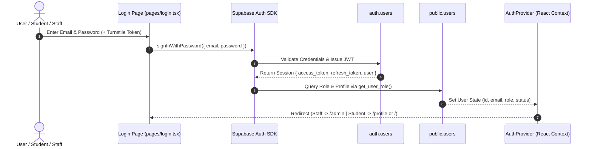

# Auth Engine & Session Lifecycle

## 1. Overview & Architecture

PharmaCore utilizes **Supabase Auth** for identity management, JWT token signing, and session persistence. The architecture couples Supabase Auth with custom role metadata stored in `public.users` and enforced via PostgreSQL Row Level Security (RLS).



---

## 2. Key Components & Implementation

### 2.1 Role Determination & Default State
When a new user signs up via `auth.users`, a database trigger (`on_auth_user_created`) automatically provisions a record in `public.users` with the role strictly defaulted to `'student'`:

```sql
CREATE OR REPLACE FUNCTION public.handle_new_user()
RETURNS TRIGGER AS $$
BEGIN
  INSERT INTO public.users (id, email, full_name, role)
  VALUES (NEW.id, NEW.email, NEW.raw_user_meta_data->>'full_name', 'student')
  ON CONFLICT (id) DO NOTHING;
  RETURN NEW;
END;
$$ LANGUAGE plpgsql SECURITY DEFINER SET search_path = public;
```

### 2.2 Client-Side Session Provider (`components/AuthProvider.tsx`)
- Listens to Supabase `onAuthStateChange` events: `SIGNED_IN`, `SIGNED_OUT`, `TOKEN_REFRESHED`, `USER_UPDATED`.
- Hydrates user profile data from `public.users`.
- Detects `must_change_password` flag and presents mandatory credential update modals.

### 2.3 Server-Side Token Verification & RBAC Guards
Serverless API routes in `pages/api/` verify user tokens using the `Authorization: Bearer <token>` header:
```typescript
const token = req.headers.authorization?.replace('Bearer ', '');
const { data: { user }, error } = await supabaseAdmin.auth.getUser(token);
if (!user) return res.status(401).json({ error: 'Unauthorized' });

const { data: profile } = await supabaseAdmin
  .from('users')
  .select('role, status')
  .eq('id', user.id)
  .single();

if (!['dev', 'super_admin', 'mentor'].includes(profile?.role)) {
  return res.status(403).json({ error: 'Forbidden: Staff access required' });
}
```

---

## 3. Security Considerations & Protections

1. **Non-Recursive Role Resolution**: The `public.get_user_role()` function runs under `SECURITY DEFINER STABLE` to prevent RLS recursion.
2. **Preventing Student Self-Privilege Escalation**: RLS policies and API validation strictly block clients from modifying their own `role` or `status` columns.
3. **Password Policy**: Enforces minimum 8 characters with required complexity validation on signup and profile password resets.
