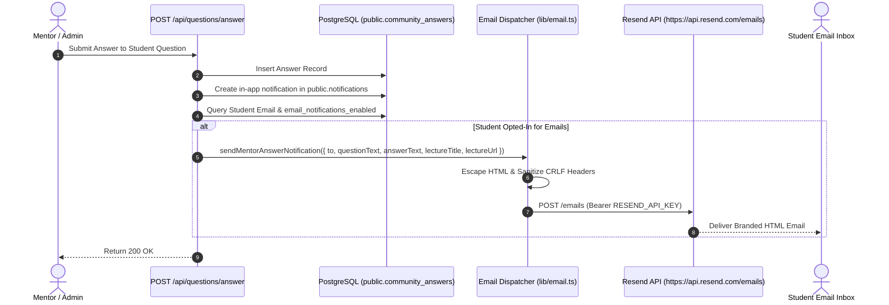

# Email Engine & Transactional Messaging

## 1. Overview & Architecture

PharmaCore delivers transactional notification emails via **Resend** using a custom, zero-dependency HTTP client defined in `lib/email.ts`. This dispatcher handles notifications for mentor question replies, student account creation, and platform-wide administrative broadcasts.



---

## 2. Security Protections in `lib/email.ts`

### 2.1 CRLF Injection Defense
To prevent email header injection attacks (where attackers inject `\r\n` characters to add arbitrary `Bcc:` or `Subject:` headers), all input strings passed into headers are sanitized:
```typescript
function sanitizeHeader(val: string): string {
  return val.replace(/[\r\n]/g, '').trim();
}
```

### 2.2 Strict HTML Entity Escaping
User-generated content (question text, mentor answer, course title) interpolated into HTML email templates is escaped to prevent email client HTML injection:
```typescript
function escapeHtml(text: string): string {
  return text
    .replace(/&/g, '&amp;')
    .replace(/</g, '&lt;')
    .replace(/>/g, '&gt;')
    .replace(/"/g, '&quot;')
    .replace(/'/g, '&#039;');
}
```

### 2.3 Non-Blocking Execution
Email dispatch is treated as an asynchronous side effect. If the Resend API encounters a rate limit or network error, the error is logged without failing the underlying database mutation.
