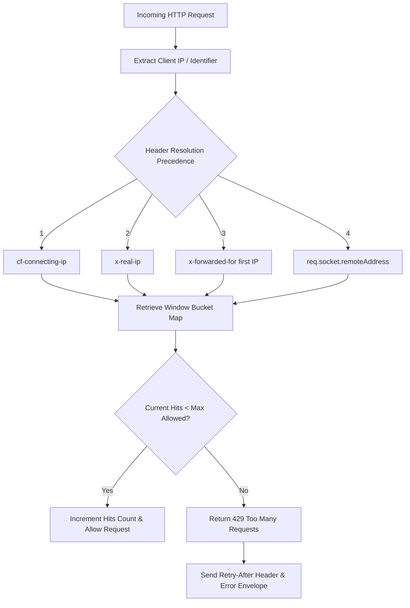

# Rate Limiting Engine

## 1. Overview & Architecture

PharmaCore implements an **in-memory sliding window rate limiter** in `lib/rateLimit.ts` to protect all API endpoints against Denial of Service (DoS), brute force attacks, credential stuffing, and spam flooding.

---

## 2. Configuration & Quota Matrix

The rate limiting engine applies customized rate limit tiers based on route sensitivity:

| Route Type | Window (ms) | Max Requests | Key Prefix | Use Case |
|---|:---:|:---:|---|---|
| **Public Question Submission** | 60,000 (1m) | 5 | `qa_submit:` | Protects `/api/questions/submit` against spam. |
| **Feedback Submission** | 60,000 (1m) | 3 | `feedback_submit:` | Protects `/api/feedback/submit` against flooding. |
| **Student Registration** | 60,000 (1m) | 3 | `student_signup:` | Protects `/api/students/signup` against account spam. |
| **Course Enrollment** | 60,000 (1m) | 5 | `course_enroll:` | Protects `/api/courses/[id]/enroll`. |
| **Admin Broadcasts** | 60,000 (1m) | 2 | `admin_broadcast:` | Protects `/api/admin/announcements/broadcast`. |
| **General API Handlers** | 60,000 (1m) | 30 | `api_general:` | Default protection for read/write endpoints. |

---

## 3. Real IP Resolution Header Precedence

To eliminate IP-spoofing via forged headers, `lib/rateLimit.ts` strictly validates proxy headers in order of trust:
1. `cf-connecting-ip` (Injected by Cloudflare Edge; cannot be forged if running behind Cloudflare).
2. `x-real-ip` (Injected by reverse proxy).
3. `x-forwarded-for` (Leftmost trimmed IPv4/IPv6 address).
4. `req.socket.remoteAddress` (Direct TCP socket address).

---

## 4. Memory Management & Eviction

- An automatic periodic cleanup interval runs every 60 seconds to purge expired timestamps from the memory `Map`.
- When the bucket count exceeds 10,000 entries, an LRU eviction strategy discards the oldest 20% of entries to guarantee heap stability.
