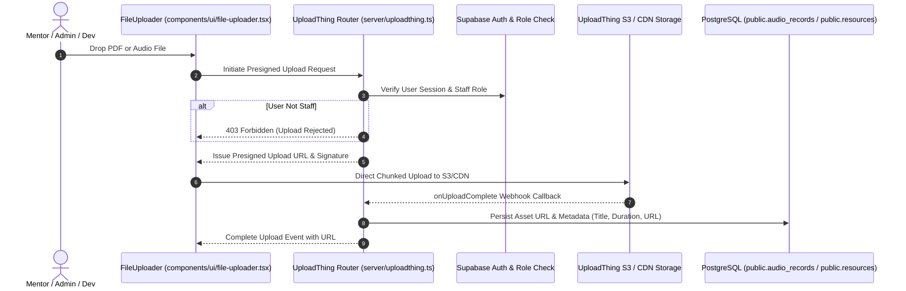

# Upload Engine & File Pipeline

## 1. Overview & Architecture

PharmaCore utilizes **UploadThing** for secure, authenticated file ingestion and CDN asset hosting. The backend router defined in `server/uploadthing.ts` acts as the gatekeeper, verifying staff authorization before granting client-side presigned upload tokens.

---

## 2. File Routes & Route-Specific Constraints

Defined in `server/uploadthing.ts`:

| Route Name | Allowed MIME Types | Max File Size | Access Control | Destination Table |
|---|---|:---:|---|---|
| `pdfUploader` | `application/pdf` | 32 MB | `dev`, `super_admin`, `mentor` | `public.resources`, `public.quizzes` |
| `audioUploader` | `audio/mpeg`, `audio/mp3`, `audio/wav`, `audio/webm` | 16 MB | `dev`, `super_admin`, `mentor` | `public.audio_records` |
| `imageUploader` | `image/png`, `image/jpeg`, `image/webp` | 8 MB | `dev`, `super_admin` | `public.courses` (thumbnail), `public.site_content` |

---

## 3. Security Hardening & Isolation

1. **Staff-Only Middleware Gate**: Every file router runs a pre-upload middleware verifying `get_user_role() IN ('dev', 'super_admin', 'mentor')`. Public visitors cannot upload files.
2. **Strict MIME-Type Validation**: File headers are verified to prevent executable upload attacks (`.exe`, `.sh`, `.php`).
3. **External CDN Isolation**: Uploaded files are hosted on UploadThing's isolated domain (`utfs.io`), eliminating server-side file execution risks.
