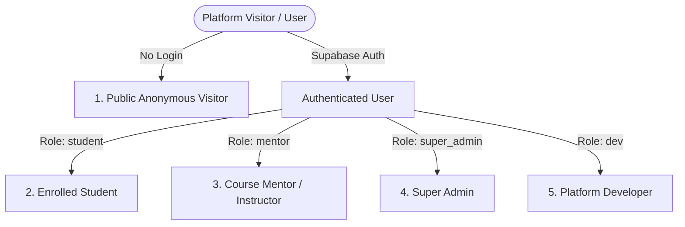

# PharmaCore — Project Overview

## 1. Executive Summary

**PharmaCore** is a specialized, modern educational web platform engineered for pharmacy students, academics, and instructors. It provides open-access course syllabus exploration, rich multimedia lecture streaming (YouTube video integration and custom high-fidelity audio record streaming), interactive quizzes with downloadable PDF solution sets, academic resource distribution (Google Drive & UploadThing hosted PDFs/images), a community Q&A discussion forum with instructor inline replies and email notifications, an end-to-end feedback submission portal, and an administrative curriculum management dashboard.

The platform is designed with a **bilingual-first** architecture, offering native English (LTR) and Arabic (RTL) localization with typography fine-tuned via `Inter` and `Tajawal` fonts.

---

## 2. Core Missions & Objectives

1. **Frictionless Learning Access**: Allow students to browse and study course materials without mandatory upfront registration for public content, while offering authenticated student profiles for private tracking, cohort enrollment requests, and notification management.
2. **Comprehensive Courseware Ecosystem**: Support modular educational structures: **Courses $\to$ Lectures $\to$ Resources, Audio Records, Quizzes & Questions $\to$ Community Discussions**.
3. **Robust Security & Trust Boundaries**: Guarantee strict isolation between administrative management, mentor-specific course assignments, authenticated student privileges, and anonymous public access using PostgreSQL Row Level Security (RLS) and Column Level Security (CLS).
4. **Resilient Performance & Offline Readiness**: Deliver sub-second page loads via Next.js SSR/ISR, dynamic component code-splitting, Edge security headers, responsive layouts across all mobile/desktop breakpoints, and Progressive Web App (PWA) installation.

---

## 3. User Personas & Role Matrix

PharmaCore establishes 5 distinct access personas managed through Supabase Auth and database RLS:

### 1. Public Anonymous Visitor (`anon`)
- **Capabilities**: Browse public course listings, view open lectures, stream YouTube videos, listen to audio records, download resources, take interactive quizzes, view community Q&A discussions, submit questions anonymously or with contact information, and submit technical/academic feedback.
- **Constraints**: Cannot access locked courses, manage curriculum, access admin dashboard, or view private student email addresses in community Q&A.

### 2. Student (`student`)
- **Capabilities**: All public capabilities plus: dedicated Student Profile (`/profile`), request enrollment into gated courses, track personal questions and mentor replies, toggle email notification preferences, mark in-app notifications as read, and edit personal university/contact profile metadata.
- **Constraints**: Cannot create/delete courses, modify site content, or access administrative endpoints.

### 3. Mentor / Instructor (`mentor`)
- **Capabilities**: Access the Administrative Dashboard (`/admin`), view and manage **assigned courses only** (via `mentor_course_assignments`), upload lectures, resources, audio records, and quizzes for assigned courses, view and reply to student questions on lecture pages and admin community hub, view platform analytics.
- **Constraints**: Cannot create new admin user accounts, cannot modify global site settings/CMS content, and cannot alter unassigned courses.

### 4. Super Admin (`super_admin`)
- **Capabilities**: Full educational platform control: create, edit, lock, unlock, and delete any course, lecture, resource, quiz, or audio record; assign mentors to courses; approve or reject student enrollment requests; manage community Q&A; review and resolve technical/academic feedback submissions; view system analytics.
- **Constraints**: Cannot modify core developer-level system configuration or CMS structure.

### 5. Developer (`dev` — Mohamed Mostafa Othman Ibrahim)
- **Capabilities**: Unrestricted superuser permissions: all Super Admin capabilities plus editable public website content CMS management (`site_content`), developer console (`DeveloperConsole.tsx`), system health monitoring, raw configuration controls, and administrative user account provisioning.

---

## 4. Key Functional Modules

### 4.1 Course & Lecture Management
- **Course Syllabus (`/course/[id]`)**: Displays course objectives, prerequisites, mentor metadata, locked status, and an ordered lecture syllabus.
- **Interactive Lecture View (`/lecture/[id]`)**:
  - Embedded responsive YouTube video player with fullscreen support.
  - Multi-track Custom Audio Player (`CustomAudioPlayer.tsx`) for voice notes and audio lectures.
  - Resource Download Section for PDFs, slide decks, and reference images.
  - Quizzes entry point and dedicated action buttons.
  - Community Q&A forum with instant question posting, anonymous toggling, and instructor inline reply cards.

### 4.2 Interactive Assessment Engine (`/quiz/[id]`)
- Step-by-step interactive quiz runner supporting Multiple Choice, True/False, and Short Text questions.
- Instant score computation, answer explanation reveals, and integrated modal viewers for Quiz PDF and Solution PDF files.

### 4.3 Student Profile & Community Hub (`/profile`)
- Unified student dashboard displaying academic details (university, faculty, graduation year).
- Real-time Course Enrollment tracking (Active, Pending, Rejected).
- Personal Community Q&A tracker displaying submitted questions, mentor answer status, and timestamped response threads.
- In-App Notification Center with unread badges and single-click read mutations.

### 4.4 Public Feedback System (`/feedback`)
- Dual-tab submission portal for:
  1. **Technical Bug Reports**: Auto-captures client device telemetry (OS, browser, viewport, user agent), reproduction steps, and severity levels (`low`, `medium`, `high`, `critical`).
  2. **Academic & Curriculum Feedback**: Course/lecture association, academic citations/references, constructive curriculum revision notes.

### 4.5 Administrative Dashboard (`/admin`)
- Dynamic, tabbed management suite loaded with code-splitting:
  - **Curriculum Manager**: Full CRUD for courses, lectures, resources, audio notes, quizzes, and questions.
  - **Enrollment Manager**: Real-time triage, approval, and rejection of student cohort access requests.
  - **User & Mentor Manager**: Role assignment, mentor course mapping, account status controls.
  - **Community Q&A Moderation**: Global forum moderation, answer authoring, student notification dispatch.
  - **Feedback Manager**: Filterable triage hub for bug reports and curriculum issues.
  - **Analytics Dashboard**: Visitor trends, pageview aggregations, popular lecture metrics.
  - **Site Content Manager (CMS)**: Real-time public landing page text, hero headlines, and FAQ overrides.
  - **Developer Console**: System health, Supabase connectivity tests, rate limiter state inspect.

---

## 5. Technical Foundations & Maturity

| Attribute | Specification |
|---|---|
| **Architecture** | Hybrid SSR / CSR with Next.js 15 Pages Router |
| **Language** | TypeScript 5 (Strict Mode enabled, 0 compiler warnings) |
| **Primary Database** | PostgreSQL via Supabase with 13 custom tables, RLS & CLS |
| **Authentication** | Supabase Auth (JWT session tokens + HTTP-only cookies) |
| **File Storage** | UploadThing (Staff-gated presigned upload router) |
| **Bot Protection** | Cloudflare Turnstile with local dev fallback |
| **Email Delivery** | Resend API with CRLF injection defense & branded HTML templates |
| **Internationalization** | `next-i18next` with `ar` (default/RTL) and `en` (LTR) |
| **Styling** | Tailwind CSS 3.4 + Radix UI accessible primitives |
| **Test Quality** | 100% automated test suite pass rate across 9 test suites |
| **Deployment Target** | Vercel Edge & Serverless Platform |

---

## 6. Assumptions & Operational Boundaries

1. **Storage Offloading**: Video content is hosted externally on YouTube. Document and audio files are hosted on UploadThing or linked to Google Drive; the PostgreSQL database strictly stores metadata and reference URLs.
2. **Stateless Node APIs**: In-memory rate limiting operates per serverless runtime instance. For multi-region serverless scaling, Redis/Upstash is identified in [TECHNICAL_DEBT.md](./TECHNICAL_DEBT.md) for future expansion.
3. **Strict Non-Destructive Migrations**: All database migrations are written with idempotent `IF NOT EXISTS` clauses and exception-handled check constraints to prevent production deployment drift.
