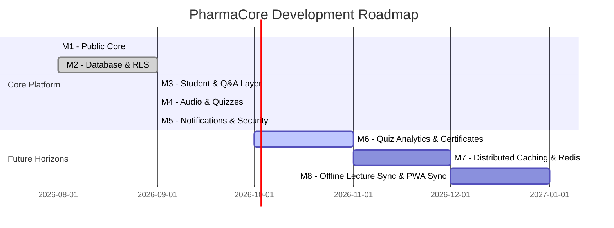

# PharmaCore — Product & Engineering Roadmap

## Current Stage: Production-Ready Baseline (Milestone M5)

PharmaCore has completed its core foundational milestones:
- ✅ **M1: Public Education Core** (Courses, Lectures, YouTube Player, Google Drive Resources).
- ✅ **M2: Database Schema Consolidation & RLS Hardening** (13 PostgreSQL Tables, non-recursive role resolver, zero 42P17 recursion).
- ✅ **M3: Student Access & Community Q&A Layer** (Student signup, profile, cohort enrollment requests, lecture Q&A forum, anonymous questions, CLS privacy).
- ✅ **M4: Audio Lecture Records & Interactive Quizzes** (Multi-track custom audio player, in-browser voice recording, quiz PDF/solution viewers).
- ✅ **M5: Notifications, Email Dispatcher & Security Hardening** (In-app notification center, Resend transactional emails, Feedback portal, Cloudflare Turnstile, 22-domain security matrix, 100% automated test pass).

---

## Upcoming Milestones & Planned Capabilities

### Milestone M6: Student Quiz Performance Analytics & Certificate Generation
- **Target Date**: Q4 2026
- **Scope**:
  - Track student quiz attempts, score history, and topic weakness breakdowns in `public.quiz_attempts`.
  - Automated PDF Certificate generation on course completion (verified 100% lecture & quiz pass).
  - Mentor dashboard for cohort-wide grade distributions and question difficulty scoring.

### Milestone M7: Distributed Caching & Multi-Region Rate Limiting
- **Target Date**: Q4 2026
- **Scope**:
  - Transition in-memory sliding window rate limiter (`lib/rateLimit.ts`) to Upstash Redis for distributed multi-instance synchronization.
  - Edge caching of course catalog and static site content via Vercel Edge KV.

### Milestone M8: Full PWA Background Sync & Offline Content Pack
- **Target Date**: Q1 2027
- **Scope**:
  - Background sync for quiz submissions when regaining connectivity.
  - IndexedDB caching of audio lecture recordings and PDF handouts for offline mobile studying.
