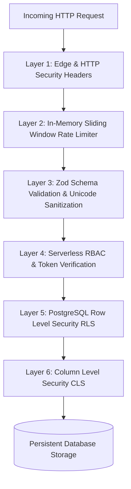

# Defense-in-Depth Security Model

## 1. Multi-Layer Security Architecture

PharmaCore establishes 6 distinct security inspection layers between an incoming HTTP request and persistent storage:

---

## 2. Security Layers Detail

### Layer 1: Edge & HTTP Security Headers (`next.config.js`)
- **Content Security Policy (CSP)**: Restricts script execution to self, Vercel, YouTube, and trusted CDNs.
- **HSTS (`Strict-Transport-Security`)**: Enforces HTTPS with `max-age=63072000; includeSubDomains; preload`.
- **Frame Options**: `X-Frame-Options: SAMEORIGIN` prevents clickjacking.
- **MIME Sniffing**: `X-Content-Type-Options: nosniff` eliminates MIME-type spoofing.
- **Cross-Origin Isolation**: `Cross-Origin-Opener-Policy: same-origin` and `Cross-Origin-Resource-Policy: same-origin`.

### Layer 2: In-Memory Rate Limiting & Throttling (`lib/rateLimit.ts`)
- Enforces sliding window request quotas per IP and per user account to mitigate brute force and DoS attacks.

### Layer 3: Input Sanitization & Type Validation (`lib/utils.ts` & `zod`)
- Strips non-printable ASCII/Unicode control characters (`[\u0000-\u0008\u000B\u000C\u000E-\u001F\u007F]`) to prevent PostgREST and JSON-LD injection.

### Layer 4: Serverless RBAC Verification
- Verifies calling user role using `supabaseAdmin.auth.getUser()` and checks against required role tier (`dev`, `super_admin`, `mentor`).

### Layer 5: PostgreSQL Row Level Security (RLS)
- 13 enabled RLS table policies enforce data isolation at the database engine level.

### Layer 6: Column Level Security (CLS)
- Restricts direct client access to sensitive columns (e.g. `community_questions.author_email`).
