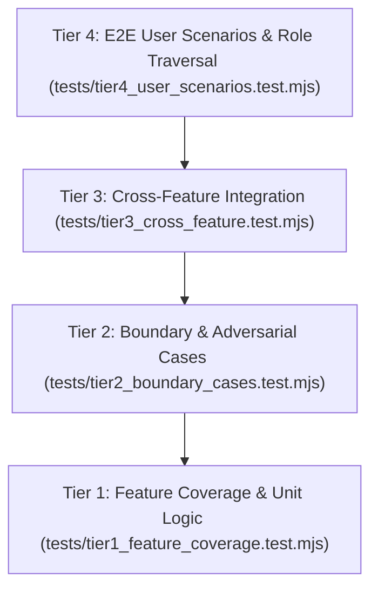

# 4-Tier Test Architecture & Framework

## 1. Zero-Dependency ESM Test Framework

Implemented in `tests/helpers/test_framework.mjs`:
- Utilizes native Node.js ESM modules.
- Formats test execution with hierarchical suites, colorized pass/fail badges, and nanosecond timing metrics.
- Exposes clean assertion primitives: `describe()`, `it()`, `expect()`, `toBe()`, `toEqual()`, `toBeDefined()`, `toThrow()`.

---

## 2. The 4-Tier Testing Pyramid

- **Tier 1 (Feature Coverage)**: Validates individual components, utilities, and endpoints in isolation.
- **Tier 2 (Boundary Cases)**: Tests payload extremes, empty collections, oversized strings, and Unicode control characters.
- **Tier 3 (Cross-Feature)**: Tests interconnected workflows (e.g. asking a question $\to$ generating in-app notification $\to$ sending email).
- **Tier 4 (User Scenarios)**: Simulates complete user sessions for all 5 roles (`anon`, `student`, `mentor`, `super_admin`, `dev`).
