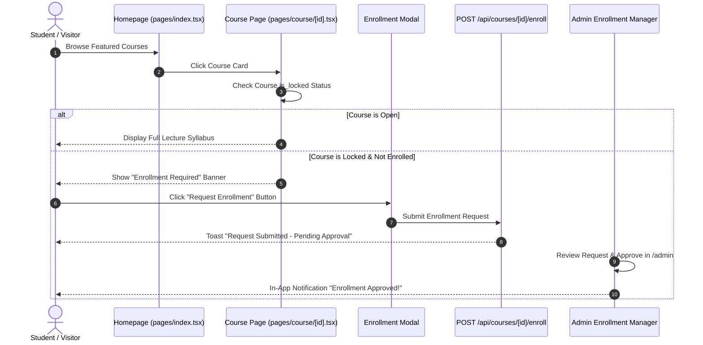
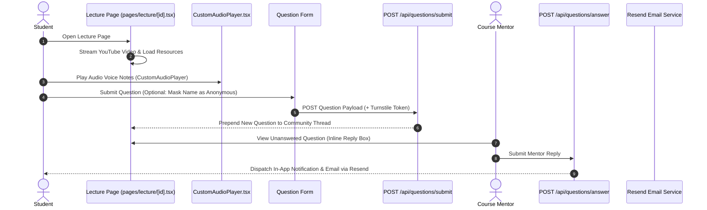
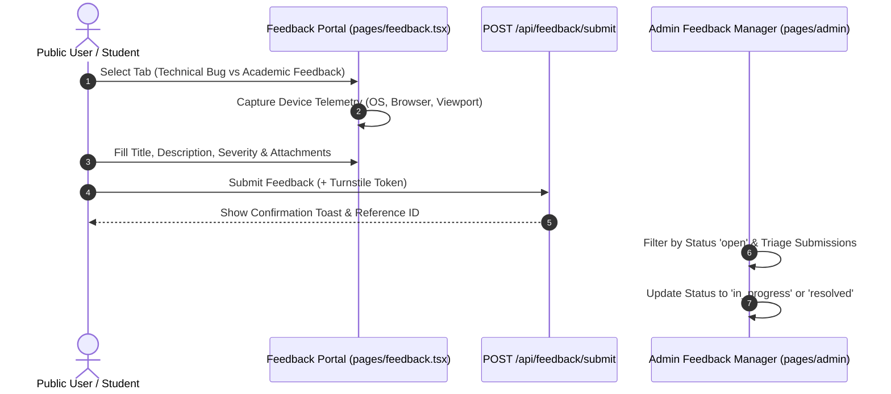

# Key User Journey Flows & UX Behavior

## 1. Course Discovery & Enrollment Journey

```mermaid
sequenceDiagram
    autonumber
    actor Student as Student / Visitor
    participant Home as Homepage (pages/index.tsx)
    participant CoursePage as Course Page (pages/course/[id].tsx)
    participant Modal as Enrollment Modal
    participant API as POST /api/courses/[id]/enroll
    participant Admin as Admin Enrollment Manager

    Student->>Home: Browse Featured Courses
    Home->>CoursePage: Click Course Card
    CoursePage->>CoursePage: Check Course is_locked Status
    alt Course is Open
        CoursePage-->>Student: Display Full Lecture Syllabus
    else Course is Locked & Not Enrolled
        CoursePage-->>Student: Show "Enrollment Required" Banner
        Student->>Modal: Click "Request Enrollment" Button
        Modal->>API: Submit Enrollment Request
        API-->>Student: Toast "Request Submitted - Pending Approval"
        Admin->>Admin: Review Request & Approve in /admin
        Admin-->>Student: In-App Notification "Enrollment Approved!"
    end
```

---

## 2. Interactive Lecture Study & Discussion Flow

```mermaid
sequenceDiagram
    autonumber
    actor Student as Student
    participant Lecture as Lecture Page (pages/lecture/[id].tsx)
    participant Audio as CustomAudioPlayer.tsx
    participant Form as Question Form
    participant API as POST /api/questions/submit
    actor Mentor as Course Mentor
    participant AnswerAPI as POST /api/questions/answer
    participant Resend as Resend Email Service

    Student->>Lecture: Open Lecture Page
    Lecture->>Lecture: Stream YouTube Video & Load Resources
    Student->>Audio: Play Audio Voice Notes (CustomAudioPlayer)
    Student->>Form: Submit Question (Optional: Mask Name as Anonymous)
    Form->>API: POST Question Payload (+ Turnstile Token)
    API-->>Lecture: Prepend New Question to Community Thread
    Mentor->>Lecture: View Unanswered Question (Inline Reply Box)
    Mentor->>AnswerAPI: Submit Mentor Reply
    AnswerAPI-->>Student: Dispatch In-App Notification & Email via Resend
```

---

## 3. Public Feedback & Bug Report Triage Flow

```mermaid
sequenceDiagram
    autonumber
    actor User as Public User / Student
    participant Portal as Feedback Portal (pages/feedback.tsx)
    participant API as POST /api/feedback/submit
    participant Admin as Admin Feedback Manager (pages/admin)

    User->>Portal: Select Tab (Technical Bug vs Academic Feedback)
    Portal->>Portal: Capture Device Telemetry (OS, Browser, Viewport)
    User->>Portal: Fill Title, Description, Severity & Attachments
    User->>API: Submit Feedback (+ Turnstile Token)
    API-->>User: Show Confirmation Toast & Reference ID
    Admin->>Admin: Filter by Status 'open' & Triage Submissions
    Admin->>Admin: Update Status to 'in_progress' or 'resolved'
```
