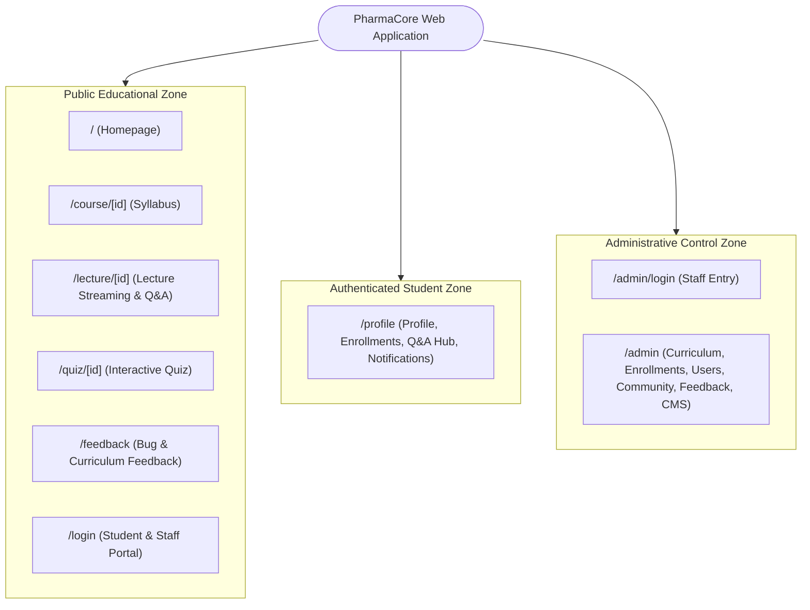

# Frontend Information Architecture & Site Map

## 1. Route Map & Accessibility Matrix

PharmaCore organizes its frontend into three main accessibility zones:

---

## 2. Page Navigation Hierarchy

1. **Header Navigation (`components/Navbar.tsx`)**:
   - Brand Logo & Home Link.
   - Course Catalog Anchor (`#courses`).
   - Feedback Link (`/feedback`).
   - Language Switcher (`AR / EN`).
   - Theme Switcher (`Light / Dark`).
   - Auth Action (Login Button $\to$ `/login` or Student Avatar Menu with Notification Counter).

2. **Footer Navigation (`components/Footer.tsx`)**:
   - Academic department credits & mission statement.
   - Quick navigation links (Courses, Feedback, Login).
   - Social links & copyright attribution.

3. **Admin Console Navigation (`components/admin/AdminSidebar.tsx` & `AdminTopNav.tsx`)**:
   - Dashboard Overview & Telemetry.
   - Curriculum Manager (Courses, Lectures, Quizzes, Audio Records).
   - Course Enrollments (Pending Requests).
   - Students Directory.
   - User Accounts Management (`dev` & `super_admin`).
   - Community Q&A Moderation Hub.
   - Feedback Triage Hub.
   - Dynamic Site Content CMS.
   - Developer Health Console (`dev` only).
