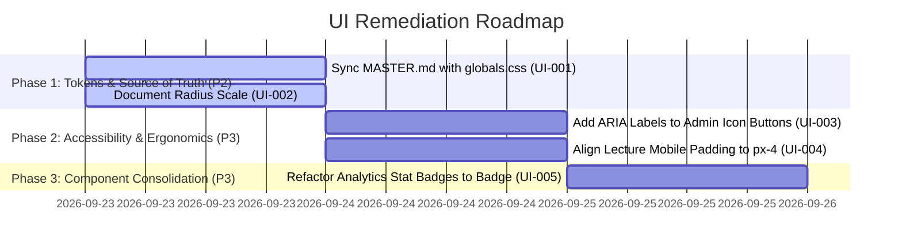

# UI & Design System Remediation Plan

This remediation plan organizes systemic root-cause fixes and polish items identified during the Full UI & Design System Integrity Audit.

---

## 1. Prioritized Remediation Roadmap

---

## 2. Remediation Item Detail & Proposed Implementation

### Phase 1: Design System Token Alignment (Severity: P2)
- **Action**: Update `design-system/pharmacore/MASTER.md` to document the active clinical cyan/teal theme:
  - Primary: `hsl(194 49% 31%)` (`#286576`)
  - Accent: `hsl(194 56% 71%)` (`#8BCDE1`)
  - Foreground / Ink: `#262626`
  - Background: `hsl(195 33% 98%)`
- **Scope**: Documentation and design system alignment.

### Phase 2: Accessibility & Layout Alignment (Severity: P3)
- **Action (UI-003)**: Add `aria-label="Edit course"` and `aria-label="Delete user"` to icon-only buttons in `components/admin/UserManager.tsx` and `CurriculumManager.tsx`.
- **Action (UI-004)**: Standardize mobile container horizontal padding in `pages/lecture/[id].tsx` from `px-3` to `px-4`.

### Phase 3: Component Standardization (Severity: P3)
- **Action (UI-005)**: Replace custom inline `.stat-pill` classes in `components/admin/AnalyticsDashboard.tsx` with `<Badge variant="secondary">`.
