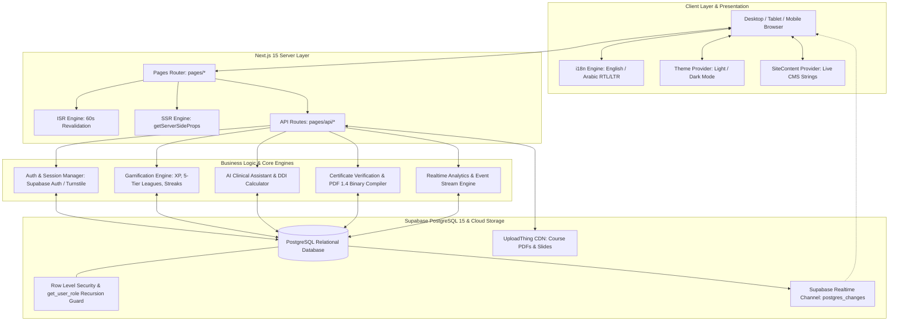
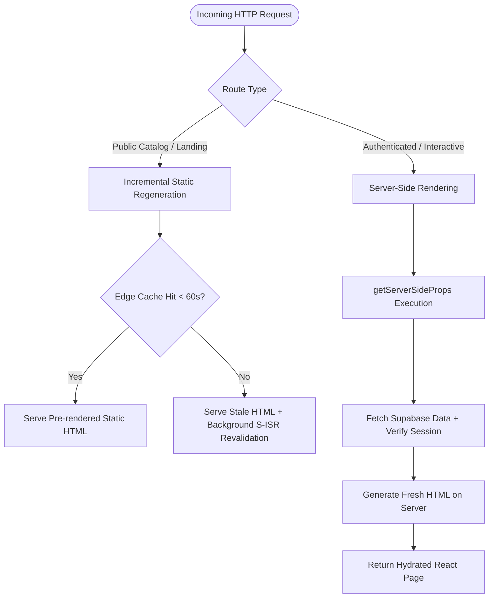
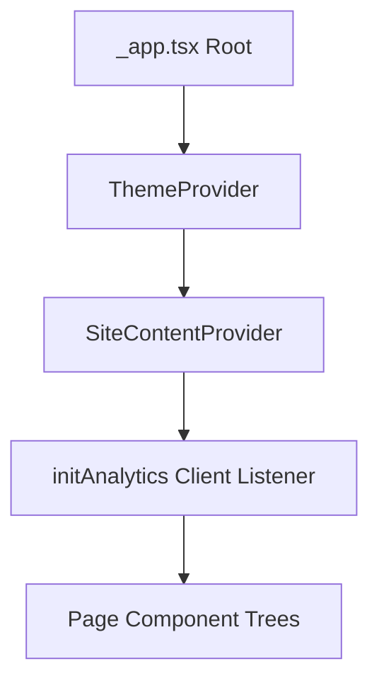
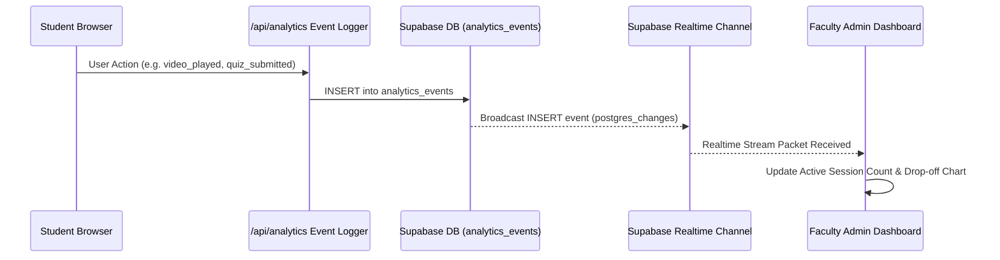

# PharmaCore System Architecture

**Version**: 1.0.0 (Production)  
**Framework**: Next.js 15.2.0 (Pages Router) • React 19.0.0 • TypeScript 5.x  
**Styling**: Tailwind CSS 3.4.19 • Radix UI Primitives • Custom Glassmorphism Design Tokens  
**Backend & Database**: Supabase PostgreSQL 15 • Supabase Realtime • Row Level Security (RLS)  

---

## 1. High-Level Architecture Overview

PharmaCore is an open-access, clinical pharmacy education and continuous professional development platform. It integrates interactive video curricula, clinical decision-support AI tools, evidence-based MCQ assessments, gamified division leagues, and automated cryptographic certificate issuance.



---

## 2. Next.js 15 Pages Router Architecture

PharmaCore utilizes the Next.js **Pages Router** architecture under `pages/`, balancing Static Site Generation with Incremental Static Regeneration (ISR) for public catalog pages and dynamic Server-Side Rendering (SSR) for authenticated student and faculty workspaces.

### 2.1 Route Directory Structure & Layout Hierarchy

```
pages/
├── _app.tsx                      # Root wrapper: ThemeProvider, SiteContentProvider, i18n RTL/LTR, Fonts
├── _document.tsx                  # HTML document: Meta headers, font preconnects, lang attributes
├── 404.tsx                        # Custom 404 error page (ISR, revalidate: 60)
├── 500.tsx                        # Custom 500 server error page
├── index.tsx                      # Landing page (ISR, revalidate: 60)
├── courses.tsx                    # Categorized course catalog (ISR, revalidate: 60)
├── dashboard.tsx                  # Student command center & learning hub (SSR)
├── leaderboard.tsx                # Multi-scope competitive leaderboards (SSR)
├── profile.tsx                    # Student profile, study streaks & badges (SSR)
├── login.tsx                      # Student authentication portal (SSR)
├── course/
│   └── [id].tsx                   # Course syllabus, curriculum overview, enrollment CTA (SSR)
├── lecture/
│   └── [id].tsx                   # Video player, lecture notes, community Q&A, AI assistant (SSR)
├── quiz/
│   └── [id].tsx                   # Timed assessment & untimed practice mode with rationales (SSR)
├── verify/
│   └── [code].tsx                 # Public certificate validation portal (SSR)
├── admin/
│   ├── login.tsx                  # Staff / Faculty administrative login (SSR)
│   └── index.tsx                  # Multi-tab faculty management console & gradebook (SSR)
└── api/
    ├── ai/consult.ts              # Clinical AI decision support assistant
    ├── certificates/              # Certificate issuance, listing, and verification
    ├── courses/[id]/enroll.ts     # Student course enrollment & unenrollment
    ├── profile/index.ts           # Student profile management
    ├── questions/                 # Community lecture Q&A discussion threads
    ├── students/                  # Student registration, profile setup, active enrollments
    ├── admin/                     # User management, enrollment approvals, CMS settings, analytics
    └── uploadthing.ts             # UploadThing file & resource upload handler
```

---

## 3. Rendering Strategy: SSR vs. ISR Patterns

The platform implements a hybrid rendering architecture to maximize Time to First Byte (TTFB), Search Engine Optimization (SEO), and data freshness.



### 3.1 Incremental Static Regeneration (ISR — `revalidate: 60`)
Static public pages (`pages/index.tsx`, `pages/courses.tsx`) utilize `getStaticProps` with a `revalidate: 60` interval.
- **Mechanism**: The page is statically generated at build time and cached on edge CDNs.
- **Revalidation**: When a visitor requests the page after 60 seconds, the cached version is served instantaneously while Next.js triggers a background regeneration. Once regenerated successfully, the edge cache is invalidated with the new static HTML.
- **Fallback**: Database outages do not bring down public landing pages, as stale cached pages are served continuously.

```typescript
// pages/courses.tsx
export const getStaticProps: GetStaticProps = async ({ locale }) => {
  const translations = await serverSideTranslations(locale ?? "en", ["common"])
  const { data: courses } = await supabase
    .from("courses")
    .select("*, mentor:users(id, first_name, last_name, avatar_url)")
    .order("order_index", { ascending: true })

  return {
    props: {
      ...translations,
      courses: courses || [],
    },
    revalidate: 60, // 60 seconds ISR cache
  }
}
```

### 3.2 Dynamic Server-Side Rendering (`getServerSideProps`)
Pages containing live user progress, dynamic course content, secure assessments, administrative tables, or cryptographic certificates utilize `getServerSideProps`.
- `pages/course/[id].tsx`: Fetches fresh course details, lecture syllabi, and student enrollment status.
- `pages/lecture/[id].tsx`: Fetches lecture video streaming meta, student watch seconds, and community Q&A threads.
- `pages/quiz/[id].tsx`: Fetches randomized assessment questions, calculates previous attempts, and loads student rationales.
- `pages/verify/[code].tsx`: Resolves certificate verification codes directly from the database to guarantee real-time verification and revocation checks.
- `pages/admin/index.tsx`: Authenticates faculty session tokens, validates role authorization (`dev`, `super_admin`, `mentor`), and aggregates gradebook matrices.

---

## 4. Internationalization (i18n) & RTL/LTR Layout Toggling

PharmaCore delivers native bilingual clinical pharmacology education in **English (`en`)** and **Arabic (`ar`)**.

### 4.1 Configuration Matrix
Configured in `next.config.js` and `next-i18next.config.js`:
- **Default Locale**: `en`
- **Supported Locales**: `en`, `ar`
- **Domain Routing**: Subpath routing (`/courses` for English, `/ar/courses` for Arabic).

### 4.2 Document Direction & Typography Handling
In `pages/_app.tsx`, document direction is dynamically managed based on the active Next.js router locale:

```typescript
// pages/_app.tsx
useEffect(() => {
  const isArabic = router.locale === "ar"
  document.documentElement.lang = router.locale || "en"
  document.documentElement.dir = isArabic ? "rtl" : "ltr"
}, [router.locale])
```

### 4.3 Typography Tokens (`lib/fonts.ts`)
- **English**: `Inter` — Clean, high-legibility geometric sans-serif for clinical tables, drug dosages, and laboratory parameters.
- **Arabic**: `Tajawal` — Modern, balanced Arabic typeface optimized for medical terminology and bidirectional technical text.

```typescript
// lib/fonts.ts
import { Inter, Tajawal } from "next/font/google"

export const fontInter = Inter({
  subsets: ["latin"],
  variable: "--font-inter",
  display: "swap",
})

export const fontTajawal = Tajawal({
  subsets: ["arabic"],
  weight: ["300", "400", "500", "700", "800", "900"],
  variable: "--font-tajawal",
  display: "swap",
})
```

In `styles/globals.css`, typography rules apply the Arabic font family to all headings and body copy whenever `[dir="rtl"]` is active:
```css
[dir="rtl"] body,
[dir="rtl"] {
  font-family: var(--font-tajawal);
}

[dir="rtl"] h1,
[dir="rtl"] h2,
[dir="rtl"] h3,
[dir="rtl"] h4 {
  font-family: var(--font-tajawal);
}
```

---

## 5. Design System & Glassmorphism Tokens

PharmaCore employs a modern clinical design system based on Tailwind CSS 3.4 and HSL (Hue-Saturation-Lightness) CSS custom properties. It balances medical professionalism with modern glassmorphism aesthetics.

### 5.1 HSL Color Palette Variables (`styles/globals.css`)

```css
@layer base {
  :root {
    --background: 195 33% 98%;
    --foreground: 0 0% 15%;
    --card: 0 0% 100%;
    --card-foreground: 0 0% 15%;
    --popover: 0 0% 100%;
    --popover-foreground: 0 0% 15%;
    --primary: 194 49% 31%;           /* Clinical Teal / Cyan Deep */
    --primary-foreground: 0 0% 100%;
    --secondary: 194 31% 92%;
    --secondary-foreground: 194 49% 24%;
    --muted: 195 25% 94%;
    --muted-foreground: 195 13% 39%;
    --accent: 194 56% 71%;            /* Vibrant Soft Cyan */
    --accent-foreground: 194 55% 18%;
    --destructive: 0 72% 46%;
    --destructive-foreground: 0 0% 100%;
    --border: 195 22% 84%;
    --input: 195 22% 78%;
    --ring: 194 49% 31%;
    --radius: 0.9rem;
    --brand-ink: #262626;
    --brand-mid: #6aa6b8;
    --brand-light: #8bcde1;
  }

  .dark {
    --background: 196 25% 8%;         /* Dark Clinical Slate */
    --foreground: 195 28% 96%;
    --card: 195 23% 11%;
    --card-foreground: 195 28% 96%;
    --popover: 195 23% 11%;
    --popover-foreground: 195 28% 96%;
    --primary: 194 56% 71%;
    --primary-foreground: 195 48% 12%;
    --secondary: 195 25% 17%;
    --secondary-foreground: 194 50% 84%;
    --muted: 195 21% 15%;
    --muted-foreground: 195 16% 68%;
    --accent: 194 36% 57%;
    --accent-foreground: 196 45% 10%;
    --destructive: 0 66% 52%;
    --destructive-foreground: 0 0% 100%;
    --border: 195 18% 23%;
    --input: 195 18% 28%;
    --ring: 194 56% 71%;
  }
}
```

### 5.2 Specialized Glassmorphism Utility Classes
- `.glass-nav`: Frosted glass navigation bar with heavy backdrop blur (`backdrop-blur-xl bg-background/80 border-border/70`).
- `.glass-panel`: Translucent card container with subtle border highlights (`backdrop-blur-xl bg-card/85 border-border/70`).
- `.clinical-grid`: Subtle mathematical background coordinate grid with radial mask falloff.
- `.hero-glow` / `.hero-glow-dark`: Radial luminous gradients highlighting key hero CTAs and statistics.
- `.bento-card`: Interactive modular bento-box card with smooth hover elevation (`transition-all duration-300 hover:-translate-y-1 hover:border-primary/50`).
- `.stat-badge`: Floating clinical metric pill with frosted backdrop.

---

## 6. Client-Side State Management & Context Providers

PharmaCore avoids bloated external state management libraries in favor of lightweight, composable React Context Providers combined with local cache persistence.



### 6.1 `ThemeProvider` (`components/ThemeProvider.tsx`)
- Manages active visual theme state (`light` vs `dark`).
- Synchronizes changes to `document.documentElement.classList`.
- Persists theme selection to browser `localStorage` under `theme` key.

### 6.2 `SiteContentProvider` (`components/SiteContentProvider.tsx`)
- Provides real-time dynamic CMS copy and global configuration strings across all child components:
  - Hero headers and sub-copy (`hero_title_en`, `hero_title_ar`, etc.).
  - Marketing announcements & top banner alerts (`marketing_banner`).
  - Lead magnet configuration (`lead_magnet`).
  - Global maintenance mode & signup settings (`registration_mode`).
  - Platform-wide feature flags (`features.ai_assistant`, `features.practice_mode`, etc.).
- Subscribes to Supabase Realtime changes on `public.site_content` to dynamically update active text without page reloads.

---

## 7. Real-Time Event Streams & Telemetry Architecture

PharmaCore includes an event-driven telemetry and analytics architecture powered by Supabase Realtime WebSocket channels (`postgres_changes`).



### 7.1 Client-Side Analytics Manager (`lib/analytics.ts`)
- **Initialization**: `initAnalytics()` establishes a persistent subscription to `public:analytics_events`.
- **Event Tracking**: `trackEvent(eventName, properties)` records user interactions (`video_played`, `quiz_submitted`, `formula_calculated`, `$pageview`).
- **Buffer & Deduplication**: Maintains an in-memory ring buffer of the last 50 events (`recentEventsBuffer`) to support instant dashboard updates with zero round-trip lag.
- **Anonymous Identification**: Generates a persistent anonymous fingerprint (`pharmacore_distinct_id`) for non-logged-in visitors.

---

## 8. Security & Edge Isolation Summary

1. **Authentication & Authorization**:
   - Supabase Auth (JWT tokens) verified server-side.
   - Non-recursive `public.get_user_role()` function prevents Postgres 42P17 recursion errors while enforcing strict role-based access control (`dev`, `super_admin`, `mentor`, `student`).
2. **Anti-Bot Defense**:
   - Cloudflare Turnstile CAPTCHA tokens validated server-side on public registration and question submission endpoints.
3. **Data Integrity & Protection**:
   - Student academic records isolated via Row-Level Security (RLS) policies.
   - Anonymous users have strictly scoped read-only access to public courses and certificate verification endpoints.
