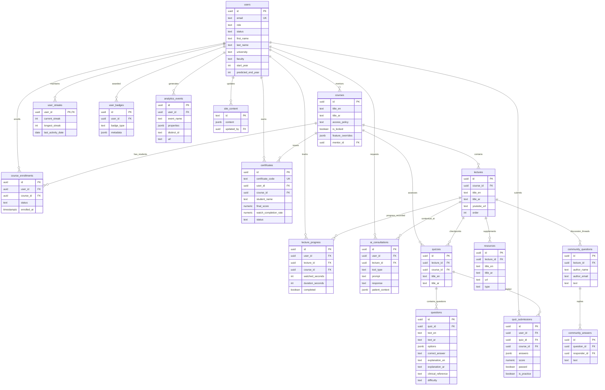
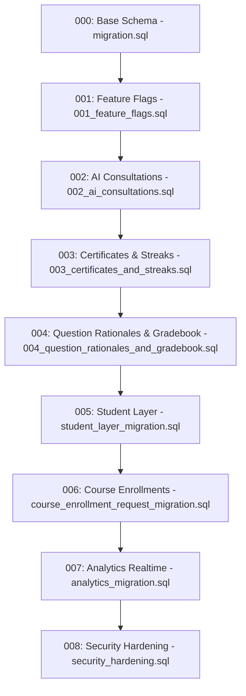

# PharmaCore Relational Database Schema & Migrations

**Engine**: PostgreSQL 15 (Supabase Hosted)  
**Security Model**: Row Level Security (RLS) with Security-Definer Non-Recursive Role Resolvers  
**Total Tables**: 17 Relational Tables  
**Extensions**: `uuid-ossp`, `pgcrypto`  

---

## 1. Entity-Relationship Diagram (ERD)



---

## 2. Table Specifications (17 Tables)

### 2.1 `public.users`
Extends `auth.users` with student profile information, academic metadata, and administrative roles.

| Column | Data Type | Constraints / Defaults | Description |
|---|---|---|---|
| `id` | `UUID` | `PK`, `REFERENCES auth.users(id) ON DELETE CASCADE` | Supabase Auth user identifier |
| `email` | `TEXT` | `NOT NULL` | User email address |
| `full_name` | `TEXT` | `NULL` | Full display name |
| `first_name` | `TEXT` | `NULL` | Student first name |
| `last_name` | `TEXT` | `NULL` | Student surname |
| `phone_number`| `TEXT` | `NULL` | International contact number |
| `university` | `TEXT` | `NULL` | Academic institution name |
| `faculty` | `TEXT` | `NULL` | Faculty / School of Pharmacy |
| `start_year` | `INTEGER` | `NULL` | Academic enrollment year |
| `predicted_end_year` | `INTEGER` | `NULL` | Expected graduation year |
| `role` | `TEXT` | `NOT NULL CHECK (role IN ('dev', 'super_admin', 'mentor', 'student')) DEFAULT 'mentor'` | Role-based permission tier |
| `status` | `TEXT` | `DEFAULT 'active' CHECK (status IN ('active', 'pending', 'suspended', 'needs_setup'))` | Account verification status |
| `must_change_password` | `BOOLEAN` | `DEFAULT false` | Password rotation enforcement flag |
| `created_at` | `TIMESTAMPTZ` | `NOT NULL DEFAULT NOW()` | Account creation timestamp |

- **Indexes**: Primary Key (`id`), `idx_users_email` on `email`.

---

### 2.2 `public.courses`
Defines academic courses, curriculum objectives, access gating, and feature flags.

| Column | Data Type | Constraints / Defaults | Description |
|---|---|---|---|
| `id` | `UUID` | `PK DEFAULT uuid_generate_v4()` | Unique course identifier |
| `title_en` | `TEXT` | `NOT NULL` | Course title in English |
| `title_ar` | `TEXT` | `NOT NULL` | Course title in Arabic |
| `description_en` | `TEXT` | `NULL` | Comprehensive curriculum overview in English |
| `description_ar` | `TEXT` | `NULL` | Comprehensive curriculum overview in Arabic |
| `objectives_en` | `TEXT` | `NULL` | Learning outcomes in English |
| `objectives_ar` | `TEXT` | `NULL` | Learning outcomes in Arabic |
| `prerequisites_en`| `TEXT` | `NULL` | Required prerequisite pharmacology knowledge |
| `prerequisites_ar`| `TEXT` | `NULL` | Required prerequisite pharmacology knowledge in Arabic |
| `thumbnail_url` | `TEXT` | `NULL` | Course cover image asset URL |
| `mentor_id` | `UUID` | `REFERENCES public.users(id) ON DELETE SET NULL` | Assigned lead instructor |
| `is_locked` | `BOOLEAN` | `DEFAULT false` | Immediate lockdown flag |
| `access_policy` | `TEXT` | `DEFAULT 'students_only' CHECK (access_policy IN ('open', 'students_only', 'enrolled_only'))` | Access gating rule |
| `feature_overrides` | `JSONB` | `DEFAULT '{}'::jsonb` | Course-specific feature flag overrides |
| `created_at` | `TIMESTAMPTZ` | `NOT NULL DEFAULT NOW()` | Course creation timestamp |

---

### 2.3 `public.lectures`
Curriculum video units and sequence order within courses.

| Column | Data Type | Constraints / Defaults | Description |
|---|---|---|---|
| `id` | `UUID` | `PK DEFAULT uuid_generate_v4()` | Unique lecture identifier |
| `course_id` | `UUID` | `NOT NULL REFERENCES public.courses(id) ON DELETE CASCADE` | Parent course reference |
| `title_en` | `TEXT` | `NOT NULL` | Lecture title in English |
| `title_ar` | `TEXT` | `NOT NULL` | Lecture title in Arabic |
| `details_en` | `TEXT` | `NULL` | Detailed notes and key points in English |
| `details_ar` | `TEXT` | `NULL` | Detailed notes and key points in Arabic |
| `youtube_url` | `TEXT` | `NOT NULL` | YouTube streaming embed URL |
| `order` | `INTEGER` | `NOT NULL DEFAULT 0` | Sequential playback order index |
| `created_at` | `TIMESTAMPTZ` | `NOT NULL DEFAULT NOW()` | Creation timestamp |

- **Indexes**: `idx_lectures_course_id` on `course_id`, `idx_lectures_order` on `(course_id, "order")`.

---

### 2.4 `public.resources`
Downloadable lecture supplements (PDFs, slide decks, diagrams).

| Column | Data Type | Constraints / Defaults | Description |
|---|---|---|---|
| `id` | `UUID` | `PK DEFAULT uuid_generate_v4()` | Unique resource identifier |
| `lecture_id` | `UUID` | `NOT NULL REFERENCES public.lectures(id) ON DELETE CASCADE` | Parent lecture reference |
| `title_en` | `TEXT` | `NOT NULL` | Resource label in English |
| `title_ar` | `TEXT` | `NOT NULL` | Resource label in Arabic |
| `url` | `TEXT` | `NOT NULL` | Storage URL / UploadThing asset URL |
| `type` | `TEXT` | `NOT NULL CHECK (type IN ('pdf', 'image', 'other')) DEFAULT 'pdf'` | File mime category |

- **Indexes**: `idx_resources_lecture_id` on `lecture_id`.

---

### 2.5 `public.quizzes`
Assessment containers attached to individual lectures or overarching courses.

| Column | Data Type | Constraints / Defaults | Description |
|---|---|---|---|
| `id` | `UUID` | `PK DEFAULT uuid_generate_v4()` | Unique quiz identifier |
| `title_en` | `TEXT` | `NOT NULL` | Quiz title in English |
| `title_ar` | `TEXT` | `NOT NULL` | Quiz title in Arabic |
| `lecture_id` | `UUID` | `REFERENCES public.lectures(id) ON DELETE CASCADE` | Optional lecture attachment |
| `course_id` | `UUID` | `REFERENCES public.courses(id) ON DELETE CASCADE` | Optional course attachment |
| `created_by` | `UUID` | `REFERENCES public.users(id) ON DELETE SET NULL` | Creator instructor ID |
| `created_at` | `TIMESTAMPTZ` | `NOT NULL DEFAULT NOW()` | Creation timestamp |

- **Constraints**: `CHECK (lecture_id IS NOT NULL OR course_id IS NOT NULL)`.
- **Indexes**: `idx_quizzes_lecture` on `lecture_id`, `idx_quizzes_course` on `course_id`.

---

### 2.6 `public.questions`
Clinical pharmacology assessment items with bilingual rationales and textbook references.

| Column | Data Type | Constraints / Defaults | Description |
|---|---|---|---|
| `id` | `UUID` | `PK DEFAULT uuid_generate_v4()` | Unique question identifier |
| `quiz_id` | `UUID` | `NOT NULL REFERENCES public.quizzes(id) ON DELETE CASCADE` | Parent quiz reference |
| `text_en` | `TEXT` | `NOT NULL` | Clinical case vignette in English |
| `text_ar` | `TEXT` | `NOT NULL` | Clinical case vignette in Arabic |
| `type` | `TEXT` | `NOT NULL CHECK (type IN ('multiple_choice', 'true_false', 'short_text'))` | Question format |
| `options` | `JSONB` | `NULL` | Array of selectable options |
| `correct_answer` | `TEXT` | `NOT NULL` | Correct option key or exact string |
| `explanation_en`| `TEXT` | `NULL` | Clinical reasoning rationale in English |
| `explanation_ar`| `TEXT` | `NULL` | Clinical reasoning rationale in Arabic |
| `clinical_reference`| `TEXT` | `NULL` | Textbook or guideline citation |
| `difficulty` | `TEXT` | `DEFAULT 'medium' CHECK (difficulty IN ('easy', 'medium', 'hard'))` | Question difficulty |
| `order` | `INTEGER` | `NOT NULL DEFAULT 0` | Question presentation sequence |

- **Indexes**: `idx_questions_quiz_id` on `quiz_id`.

---

### 2.7 `public.quiz_submissions`
Records student quiz attempts, answers, percentage scores, and practice modes.

| Column | Data Type | Constraints / Defaults | Description |
|---|---|---|---|
| `id` | `UUID` | `PK DEFAULT gen_random_uuid()` | Unique attempt record identifier |
| `user_id` | `UUID` | `NOT NULL REFERENCES auth.users(id) ON DELETE CASCADE` | Student user reference |
| `quiz_id` | `UUID` | `NOT NULL REFERENCES public.quizzes(id) ON DELETE CASCADE` | Assessed quiz reference |
| `course_id` | `UUID` | `REFERENCES public.courses(id) ON DELETE CASCADE` | Related course reference |
| `answers` | `JSONB` | `NOT NULL DEFAULT '{}'::jsonb` | Itemized student responses |
| `score` | `NUMERIC` | `NOT NULL CHECK (score >= 0 AND score <= 100)` | Percentage grade (0-100) |
| `passed` | `BOOLEAN` | `NOT NULL DEFAULT false` | Pass indicator ($\ge 70\%$) |
| `is_practice` | `BOOLEAN` | `NOT NULL DEFAULT false` | Practice mode flag |
| `submitted_at` | `TIMESTAMPTZ` | `NOT NULL DEFAULT NOW()` | Submission timestamp |

- **Indexes**: `idx_quiz_submissions_user` on `user_id`, `idx_quiz_submissions_quiz` on `quiz_id`, `idx_quiz_submissions_course` on `course_id`, `idx_quiz_submissions_submitted` on `submitted_at DESC`.

---

### 2.8 `public.lecture_progress`
Granular video playback telemetry and completion status per student.

| Column | Data Type | Constraints / Defaults | Description |
|---|---|---|---|
| `id` | `UUID` | `PK DEFAULT gen_random_uuid()` | Unique progress record ID |
| `user_id` | `UUID` | `NOT NULL REFERENCES auth.users(id) ON DELETE CASCADE` | Student user reference |
| `lecture_id` | `UUID` | `NOT NULL REFERENCES public.lectures(id) ON DELETE CASCADE` | Lecture reference |
| `course_id` | `UUID` | `REFERENCES public.courses(id) ON DELETE CASCADE` | Course reference |
| `watched_seconds`| `INTEGER` | `NOT NULL DEFAULT 0 CHECK (watched_seconds >= 0)` | Verified playback duration |
| `duration_seconds`| `INTEGER` | `NOT NULL DEFAULT 0 CHECK (duration_seconds >= 0)` | Total video duration |
| `completed` | `BOOLEAN` | `NOT NULL DEFAULT false` | Watch completion indicator |
| `last_watched_at` | `TIMESTAMPTZ` | `NOT NULL DEFAULT NOW()` | Telemetry heartbeat timestamp |

- **Constraints**: `UNIQUE (user_id, lecture_id)`.
- **Indexes**: `idx_lecture_progress_user` on `user_id`, `idx_lecture_progress_lecture` on `lecture_id`, `idx_lecture_progress_completed` on `completed`.

---

### 2.9 `public.course_enrollments`
Manages student cohort enrollments and faculty approval workflows.

| Column | Data Type | Constraints / Defaults | Description |
|---|---|---|---|
| `id` | `UUID` | `PK DEFAULT gen_random_uuid()` | Enrollment record ID |
| `user_id` | `UUID` | `NOT NULL REFERENCES public.users(id) ON DELETE CASCADE` | Student user reference |
| `course_id` | `UUID` | `NOT NULL REFERENCES public.courses(id) ON DELETE CASCADE` | Course reference |
| `status` | `TEXT` | `DEFAULT 'active' CHECK (status IN ('active', 'pending', 'rejected', 'completed'))` | Cohort status |
| `enrolled_at` | `TIMESTAMPTZ` | `NOT NULL DEFAULT NOW()` | Enrollment timestamp |

- **Constraints**: `UNIQUE (user_id, course_id)`.
- **Indexes**: `idx_course_enrollments_status` on `status`.

---

### 2.10 `public.certificates`
Authoritative course mastery credentials with tamper-proof verification codes.

| Column | Data Type | Constraints / Defaults | Description |
|---|---|---|---|
| `id` | `UUID` | `PK DEFAULT gen_random_uuid()` | Unique credential identifier |
| `certificate_code` | `TEXT` | `UNIQUE NOT NULL` | Standard code (`PHARMA-YYYY-XXXX-XXXX`) |
| `user_id` | `UUID` | `REFERENCES auth.users(id) ON DELETE CASCADE` | Recipient student reference |
| `course_id` | `UUID` | `REFERENCES public.courses(id) ON DELETE CASCADE` | Completed course reference |
| `student_name` | `TEXT` | `NOT NULL` | Certified student display name |
| `course_title_en` | `TEXT` | `NOT NULL` | Course title in English |
| `course_title_ar` | `TEXT` | `NULL` | Course title in Arabic |
| `final_score` | `NUMERIC` | `NOT NULL CHECK (final_score >= 0 AND final_score <= 100)` | Verified quiz average ($\ge 80\%$) |
| `watch_completion_rate`| `NUMERIC` | `NOT NULL CHECK (watch_completion_rate >= 0 AND watch_completion_rate <= 100)`| Verified watch rate ($= 100\%$) |
| `status` | `TEXT` | `NOT NULL DEFAULT 'valid' CHECK (status IN ('valid', 'revoked'))` | Credential status |
| `issue_date` | `TIMESTAMPTZ` | `NOT NULL DEFAULT NOW()` | Official date of issuance |
| `metadata` | `JSONB` | `DEFAULT '{}'::jsonb` | Additional verification metadata |

- **Indexes**: `idx_certificates_code` on `certificate_code` (UNIQUE), `idx_certificates_status` on `status`, `idx_certificates_user` on `user_id`.

---

### 2.11 `public.user_streaks`
Tracks consecutive active study days for daily gamification.

| Column | Data Type | Constraints / Defaults | Description |
|---|---|---|---|
| `user_id` | `UUID` | `PK REFERENCES auth.users(id) ON DELETE CASCADE` | Student user reference |
| `current_streak` | `INTEGER` | `NOT NULL DEFAULT 0 CHECK (current_streak >= 0)` | Consecutive active days |
| `longest_streak` | `INTEGER` | `NOT NULL DEFAULT 0 CHECK (longest_streak >= 0)` | Historical record streak |
| `last_activity_date`| `DATE` | `NULL` | Last active UTC date (`YYYY-MM-DD`) |
| `updated_at` | `TIMESTAMPTZ` | `NOT NULL DEFAULT NOW()` | Last update timestamp |

- **Indexes**: `idx_user_streaks_last_activity` on `last_activity_date`.

---

### 2.12 `public.user_badges`
Awards milestone achievements (`streak_3`, `streak_7`, `streak_30`, `course_mastery`, `perfect_score`).

| Column | Data Type | Constraints / Defaults | Description |
|---|---|---|---|
| `id` | `UUID` | `PK DEFAULT gen_random_uuid()` | Badge award ID |
| `user_id` | `UUID` | `NOT NULL REFERENCES auth.users(id) ON DELETE CASCADE` | Award recipient reference |
| `badge_type` | `TEXT` | `NOT NULL` | Unique badge identifier |
| `awarded_at` | `TIMESTAMPTZ` | `NOT NULL DEFAULT NOW()` | Award timestamp |
| `metadata` | `JSONB` | `DEFAULT '{}'::jsonb` | Additional context |

- **Constraints**: `UNIQUE (user_id, badge_type)`.
- **Indexes**: `idx_user_badges_user` on `user_id`, `idx_user_badges_type` on `badge_type`.

---

### 2.13 `public.ai_consultations`
Audit logs and caches for AI interactions, renal/pediatric calculations, and DDI checks.

| Column | Data Type | Constraints / Defaults | Description |
|---|---|---|---|
| `id` | `UUID` | `PK DEFAULT gen_random_uuid()` | Consultation session identifier |
| `user_id` | `UUID` | `REFERENCES auth.users(id) ON DELETE SET NULL` | Student user reference |
| `lecture_id` | `UUID` | `REFERENCES public.lectures(id) ON DELETE SET NULL` | Contextual lecture reference |
| `tool_type` | `TEXT` | `NOT NULL` | Tool executed (`dose_calculator`, `interaction_checker`, `lecture_qa`, `general_consult`) |
| `prompt` | `TEXT` | `NOT NULL` | Clinical question or input parameters |
| `response` | `TEXT` | `NOT NULL` | Generated guidance or formula result |
| `patient_context` | `JSONB` | `DEFAULT NULL` | Structured patient parameters |
| `created_at` | `TIMESTAMPTZ` | `NOT NULL DEFAULT NOW()` | Log timestamp |

- **Indexes**: `idx_ai_consultations_user` on `user_id`, `idx_ai_consultations_tool` on `tool_type`, `idx_ai_consultations_created` on `created_at DESC`.

---

### 2.14 `public.community_questions`
Peer-to-peer and mentor Q&A discussion threads attached to lectures.

| Column | Data Type | Constraints / Defaults | Description |
|---|---|---|---|
| `id` | `UUID` | `PK DEFAULT uuid_generate_v4()` | Unique discussion thread ID |
| `lecture_id` | `UUID` | `NOT NULL REFERENCES public.lectures(id) ON DELETE CASCADE` | Associated lecture reference |
| `author_name` | `TEXT` | `NOT NULL` | Author display name |
| `author_email`| `TEXT` | `NOT NULL` | Author email (Restricted from public SELECT) |
| `text` | `TEXT` | `NOT NULL` | Question body |
| `created_at` | `TIMESTAMPTZ` | `NOT NULL DEFAULT NOW()` | Post timestamp |

- **Security Note**: `author_email` is revoked from public SELECT grants (`REVOKE SELECT ON public.community_questions FROM anon, authenticated; GRANT SELECT (id, lecture_id, author_name, text, created_at) ON public.community_questions TO anon, authenticated;`).

---

### 2.15 `public.community_answers`
Verified instructor, mentor, and peer responses to lecture discussions.

| Column | Data Type | Constraints / Defaults | Description |
|---|---|---|---|
| `id` | `UUID` | `PK DEFAULT uuid_generate_v4()` | Response identifier |
| `question_id` | `UUID` | `NOT NULL REFERENCES public.community_questions(id) ON DELETE CASCADE` | Parent question thread reference |
| `responder_id` | `UUID` | `REFERENCES public.users(id) ON DELETE SET NULL` | Answering mentor/user reference |
| `text` | `TEXT` | `NOT NULL` | Response text |
| `created_at` | `TIMESTAMPTZ` | `NOT NULL DEFAULT NOW()` | Response timestamp |

- **Indexes**: `idx_community_answers_question` on `question_id`.

---

### 2.16 `public.analytics_events`
High-throughput telemetry event stream for user behavior analysis and live dashboards.

| Column | Data Type | Constraints / Defaults | Description |
|---|---|---|---|
| `id` | `UUID` | `PK DEFAULT uuid_generate_v4()` | Event identifier |
| `event_name` | `TEXT` | `NOT NULL` | Interaction identifier (e.g. `video_played`, `quiz_submitted`, `$pageview`) |
| `properties` | `JSONB` | `NOT NULL DEFAULT '{}'::jsonb` | Event payload metadata |
| `distinct_id` | `TEXT` | `NULL` | Anonymous or persistent client ID |
| `user_id` | `UUID` | `REFERENCES public.users(id) ON DELETE SET NULL` | Authenticated user reference |
| `url` | `TEXT` | `NULL` | Page URL pathname |
| `created_at` | `TIMESTAMPTZ` | `NOT NULL DEFAULT NOW()` | Event timestamp |

- **Indexes**: `idx_analytics_events_name` on `event_name`, `idx_analytics_events_created` on `created_at DESC`, `idx_analytics_events_user` on `user_id`.
- **Publication**: Registered in `supabase_realtime` publication for WebSocket broadcasting.

---

### 2.17 `public.site_content`
Dynamic CMS configuration, marketing banners, and platform-wide feature flags.

| Column | Data Type | Constraints / Defaults | Description |
|---|---|---|---|
| `id` | `TEXT` | `PK` (e.g. `'main'`) | Content document key |
| `content` | `JSONB` | `NOT NULL DEFAULT '{}'::jsonb` | Structured CMS dictionary |
| `updated_by` | `UUID` | `REFERENCES public.users(id) ON DELETE SET NULL` | Editing administrator ID |
| `updated_at` | `TIMESTAMPTZ` | `NOT NULL DEFAULT NOW()` | Last update timestamp |

---

## 3. Migration Lineage & Execution Sequence

Database migrations must be applied in the following chronological order:



1. **`supabase/migration.sql`**: Creates core tables (`users`, `courses`, `lectures`, `resources`, `quizzes`, `questions`, `community_questions`, `community_answers`, `site_content`), sets up auth triggers and base RLS policies.
2. **`supabase/migrations/001_feature_flags.sql`**: Adds `feature_overrides` JSONB to `courses` and initializes global flags.
3. **`supabase/migrations/002_ai_consultations.sql`**: Creates `ai_consultations` table for clinical AI logging.
4. **`supabase/migrations/003_certificates_and_streaks.sql`**: Creates `certificates`, `user_streaks`, and `user_badges` tables with public verification policies.
5. **`supabase/migrations/004_question_rationales_and_gradebook.sql`**: Enhances `questions` with `explanation_en`, `explanation_ar`, `clinical_reference`, and `difficulty`; creates `quiz_submissions` and `lecture_progress`.
6. **`supabase/student_layer_migration.sql`**: Adds `student` role constraint and profile columns to `users`; creates `course_enrollments`.
7. **`supabase/course_enrollment_request_migration.sql`**: Configures student enrollment workflows and status transitions.
8. **`supabase/analytics_migration.sql`**: Creates `analytics_events` table and registers it with `supabase_realtime`.
9. **`supabase/security_hardening.sql`**: Establishes the non-recursive `public.get_user_role()` function and hardens RLS policies against recursion errors.

---

## 4. Security Hardening & RLS Recursion Guard

### 4.1 The Postgres 42P17 Infinite Recursion Problem
When an RLS policy on `public.users` evaluates `SELECT role FROM public.users WHERE id = auth.uid()`, querying `public.users` within its own policy triggers an infinite recursive evaluation loop, crashing queries with PostgreSQL error `42P17: infinite recursion detected in policy for relation "users"`.

### 4.2 The Solution: `SECURITY DEFINER` Role Resolver
In `supabase/security_hardening.sql`, PharmaCore implements a secure, stable resolver function that bypasses the calling query's RLS context:

```sql
CREATE OR REPLACE FUNCTION public.get_user_role()
RETURNS TEXT AS $$
  SELECT role FROM public.users WHERE id = auth.uid();
$$ LANGUAGE sql SECURITY DEFINER STABLE SET search_path = public;

GRANT EXECUTE ON FUNCTION public.get_user_role() TO anon, authenticated, service_role;
```

### 4.3 Standardized Non-Recursive RLS Policies
All administrative policies across `users`, `course_enrollments`, `analytics_events`, and `quiz_submissions` query `public.get_user_role()` directly:

```sql
-- Non-recursive user profile access
CREATE POLICY "Users read own profile" ON public.users
  FOR SELECT USING (id = auth.uid());

CREATE POLICY "Admins read all users" ON public.users
  FOR SELECT USING (public.get_user_role() IN ('dev', 'super_admin', 'mentor'));
```
