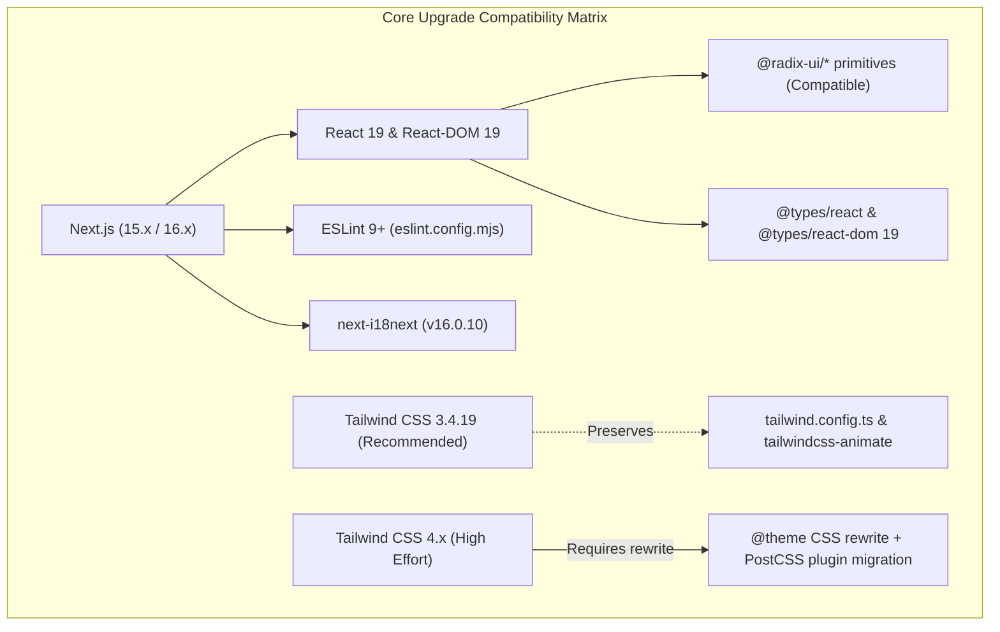

# Project Status Review & Package Upgrade Plan

## Goal Description
Review the current status and health of the **PharmaCore** Next.js project, analyze all installed packages against their latest upstream versions, evaluate potential peer dependency conflicts and breaking changes, and provide a structured plan for upgrading the codebase safely.

---

## Current Project Status & Baseline Health

A comprehensive health and compilation check was performed on the existing repository:

- **Framework**: Next.js `14.2.35` (Pages Router)
- **Runtime**: Node.js `v26.7.0` / npm `11.19.0`
- **UI & Styling**: Tailwind CSS `3.4.17`, Radix UI primitives, `tailwindcss-animate`, `class-variance-authority`, `tailwind-merge`
- **Localization**: `next-i18next` `15.4.3` (supporting English `en` and Arabic `ar` with RTL/LTR dynamic switching)
- **Backend / Database**: Supabase JS Client `2.112.3`
- **File Management & Uploads**: UploadThing `7.7.4`
- **Analytics & Observability**: Vercel Analytics `2.0.1`, Vercel Speed Insights `2.0.0`
- **Baseline Build**: Verified with `npm run build` &mdash; compiles and generates all 8 static/dynamic routes and 14 API endpoints cleanly.
- **Baseline Linting**: Verified with `npm run lint` &mdash; 0 warnings, 0 errors.
- **Known Quirks**: Scripts in `package.json` currently use `NEXT_IGNORE_INCORRECT_LOCKFILE=1` due to an extraneous `@next/swc` entry in `package-lock.json`.

---

## Detailed Package Upgrade Audit

| Package Name | Current in `package.json` | Installed Version | Latest Registry Version | Status / Upgrade Impact |
| :--- | :--- | :--- | :--- | :--- |
| **`next`** | `14.2.35` | `14.2.35` | `16.3.1` (Next 15/16) | Major leap. Requires React 19/18 alignment, `next-i18next` v16, removal of deprecated `swcMinify`. |
| **`react`** | `^18.3.1` | `18.3.1` | `19.2.8` | Major leap (React 19). Requires updated `@types/react` and peer dependency checks. |
| **`react-dom`** | `^18.3.1` | `18.3.1` | `19.2.8` | Matches React version. |
| **`@types/react`** | `^18.3.3` | `18.3.31` | `19.2.18` | Major leap matching React 19 types. |
| **`@types/react-dom`** | `^18.3.0` | `18.3.7` | `19.2.4` | Major leap matching React 19 types. |
| **`next-i18next`** | `^15.0.0` | `15.4.3` | `16.0.10` | Major leap. v16 adds compatibility for modern Next.js versions. |
| **`tailwindcss`** | `^3.4.17` | `3.4.17` | `4.3.3` (or `3.4.19`) | Major architecture change in v4 (CSS-first config, `@theme` migration). `3.4.19` is the latest stable v3. |
| **`eslint`** | `^8` | `8.57.1` | `10.8.1` (v9/v10) | Major leap. ESLint 9+ uses Flat Config (`eslint.config.mjs`) instead of `.eslintrc.json`. |
| **`eslint-config-next`** | `^14.2.14` | `14.2.35` | `16.3.1` | Aligns with Next.js version; requires ESLint 9+. |
| **`@types/node`** | `^20.19.43` | `20.19.43` | `26.2.0` / `22.x` | Safe upgrade to Node 22 LTS or Node 26 types. |
| **`typescript`** | `^5` | `5.9.3` | `7.0.2` | TypeScript 5.9.x is currently standard and fully supported. |
| **`@radix-ui/*`** (8 packages) | `^1.x` - `^2.x` | Latest | Latest | Already at latest available versions. |
| **`@supabase/supabase-js`** | `^2.112.3` | `2.112.3` | `2.112.3` | Already at latest available version. |
| **`uploadthing` / `@uploadthing/react`** | `^7.7.4` / `^7.3.3` | Latest | Latest | Already at latest available versions. |
| **`@vercel/analytics` / `speed-insights`**| `^2.0.1` / `^2.0.0` | Latest | Latest | Already at latest available versions. |
| **`i18next` / `react-i18next`** | `^26.3.6` / `^17.0.11`| Latest | Latest | Already at latest available versions. |
| **`zod`** | `^4.4.3` | `4.4.3` | `4.4.3` | Already at latest available version. |
| **`clsx` / `tailwind-merge` / `cva`** | Latest | Latest | Latest | Already at latest available versions. |
| **`postcss` / `autoprefixer`** | Latest | Latest | Latest | Already at latest available versions. |

---

## Conflict & Risk Analysis



### Key Findings & Breaking Changes:
1. **ESLint 9 Flat Config Requirement**: Upgrading `eslint-config-next` to modern versions requires `eslint@^9.0.0` and converting `.eslintrc.json` to `eslint.config.mjs`.
2. **`next.config.js` Cleanup**: `swcMinify: true` must be removed as SWC minification is enabled by default and the flag was deprecated/removed in newer Next.js releases.
3. **Tailwind CSS v4 vs v3**: Tailwind CSS v4 removes `tailwind.config.ts` entirely and replaces it with `@import "tailwindcss";` and `@theme` directives in CSS. `tailwindcss-animate` and custom HSL color variable mappings would require complete stylesheet refactoring. Upgrading to the latest `tailwindcss@3.4.19` keeps total styling stability without regressions.
4. **Lockfile Health**: Removing `NEXT_IGNORE_INCORRECT_LOCKFILE=1` from `package.json` scripts and rebuilding a pristine `package-lock.json` will ensure native CLI execution and cleaner CI/CD builds.

---

## Proposed Upgrade Pathways

### Pathway A: Modern Next.js + React 19 Upgrade (Recommended Full Upgrade)
- **Packages Upgraded**:
  - `next`: `14.2.35` &rarr; `latest` (`16.3.x` / `15.x`)
  - `react` & `react-dom`: `18.3.1` &rarr; `^19.2.8`
  - `@types/react` & `@types/react-dom`: `18.3.x` &rarr; `^19.2.x`
  - `next-i18next`: `^15.0.0` &rarr; `^16.0.10`
  - `eslint`: `^8` &rarr; `^9`
  - `eslint-config-next`: `^14.2.14` &rarr; `latest`
  - `@types/node`: `^20.19.43` &rarr; `^22.x` / `^26.x`
  - `tailwindcss`: `3.4.17` &rarr; `3.4.19` (safest for CSS animations and shadcn UI)
- **Configuration Adjustments**:
  - Migrate `.eslintrc.json` &rarr; `eslint.config.mjs`.
  - Remove `swcMinify` from `next.config.js`.
  - Remove `NEXT_IGNORE_INCORRECT_LOCKFILE=1` from `package.json` scripts.
  - Re-generate clean `package-lock.json`.

### Pathway B: Zero-Risk Stability Maintenance Upgrade
- Keep Next.js 14 and React 18 on their latest patch releases (`next@14.2.35`, `react@18.3.1`, `tailwindcss@3.4.19`, `@types/node@20.x`).
- Clean up lockfile discrepancies and remove `NEXT_IGNORE_INCORRECT_LOCKFILE=1`.
- Retain `.eslintrc.json` and existing config intact.

---

## User Review Required

> [!IMPORTANT]
> **Preferred Upgrade Path**: Please confirm whether you would like to proceed with **Pathway A** (Upgrade Next.js, React 19, next-i18next v16, ESLint 9 Flat Config, and clean lockfile) or **Pathway B** (Preserve current major versions and clean lockfile/patch updates only).

> [!NOTE]
> Tailwind CSS is kept on the latest stable `3.4.19` in both pathways to prevent breaking `tailwind.config.ts`, `tailwindcss-animate`, and custom Radix/shadcn color themes. If you also want to migrate to Tailwind v4 CSS-first architecture, let us know!

---

## Proposed Changes (For Pathway A)

### Configuration & Package Updates

#### [MODIFY] [package.json](file:///home/bravo-07/Documents/dev/yo-project/package.json)
- Update dependencies for `next`, `react`, `react-dom`, `next-i18next`, `eslint`, `eslint-config-next`, `@types/react`, `@types/react-dom`, `@types/node`, and `tailwindcss`.
- Clean up `scripts` to remove `NEXT_IGNORE_INCORRECT_LOCKFILE=1`.

#### [MODIFY] [next.config.js](file:///home/bravo-07/Documents/dev/yo-project/next.config.js)
- Remove deprecated `swcMinify: true` property.

#### [NEW] [eslint.config.mjs](file:///home/bravo-07/Documents/dev/yo-project/eslint.config.mjs)
- Create modern ESLint 9 flat config using `@next/eslint-plugin-next`.

#### [DELETE] [.eslintrc.json](file:///home/bravo-07/Documents/dev/yo-project/.eslintrc.json)
- Remove legacy ESLint 8 configuration.

---

## Verification Plan

### Automated Tests & Checks
1. **Dependency Installation**:
   ```bash
   npm install
   ```
2. **Type Checking & Next.js Build**:
   ```bash
   npm run build
   ```
3. **Linting Verification**:
   ```bash
   npm run lint
   ```

### Manual Verification
1. **Development Server**: Start `npm run dev` and verify no console warnings or runtime hydration errors occur.
2. **Key Pages Inspection**:
   - Landing page `/` & locale switching (`/ar`).
   - Authentication flow `/login`.
   - Admin dashboard `/admin` and route protections.
   - Course detail and quiz routes.
